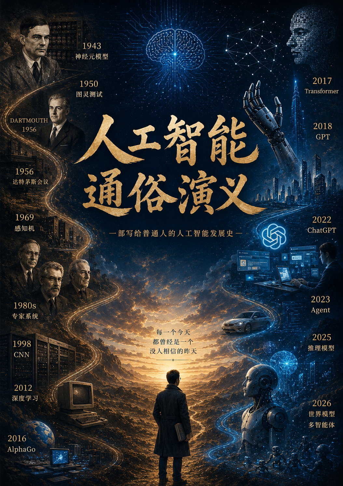

# 楔子

写这本书之前，有一桩事情我必须先说清楚。

我小时候读书，最怕的是数学和物理。不是我不肯用功，实在是因为那些公式太冷、太硬、太不讲情面。你看那教科书上，一行行推导工工整整，一个个定理铁板钉钉——好像这些东西是从天上掉下来的，跟活人没有半点关系。

后来读到一篇文章，让我对这件事有了完全不同的认识。那篇文章讲到一次世界大战时，一个叫拉莫尔的物理学家在战壕里写论文。炮弹就在头顶上飞来飞去，他却趴在泥地里推导他的公式。那一刻我突然明白——每一个公式背后，都有一个人；每一个人背后，都有一段故事。

那些故事里有血、有火、有汗、有泪。有深夜实验室里孤独的灯光，有学术会议上拍桌子的争吵，有二十岁少年一鸣惊人的狂喜，也有六旬老匠人一生心血付诸东流的悲凉。

若把这些故事写出来，那便是一部英雄传奇。

这部传奇里，有贫民窟里自学成才的天才少年，有战场上破译密码的数学奇才，有两个年轻人用数学画出大脑第一张草图的故事，有一本三百页的书把整个研究领域打入冷宫的公案，有三十年无人问津却在某个深夜突然找到突破口的狂喜，有一个人对着一台电脑说了一年“这不是笑话”的执拗。

这些故事串在一起，便是智能科学近八十年的兴衰沉浮——从1943年的第一个神经元模型，到如今能写诗作画、能自主行动的AI大模型。

这部传奇的写法，我参照了前人的一个法子——把严肃的科学史，包裹在一层“通俗演义”的糖衣里。这法子不是我的发明。早在一百年前，就有人用章回体写过《科学演义》；后来又有梁衡先生，把数理化三大学科的故事讲得老少咸宜。

如今我斗胆效仿，把这个法子借用到人工智能科学上来。

书分十二回。从感知机的狂欢与寒冬，到专家系统的称霸与崩塌；从深度学习在黑暗中默默积蓄力量，到Transformer架构一夜之间改变世界；从GPT的千亿参数撑起人工智能的骨架，到Agent与Skill给大模型装上手脚和工具；再到如今最前沿的推理模型、世界模型与多智能体协同——这八十年的路，一步一个脚印，每一步都写满了人的执着与挣扎。

写这本书，只有一个愿望：当你翻开这本书时，你看到的不是一排排公式定理，而是一群活生生的人。他们跟你一样，会笑、会哭、会争吵、会迷茫。他们用一生追问“机器能否思考”这个问题——不是为了名，不是为了利，只是因为他们想知道答案。

这答案，至今还没完全找到。但正是这种“还没找到”的状态，让这个故事一直在继续。

这颗火种，至今未熄。

是为楔子。

# 第一回

**贫儿避难窥天机  
神童论道惊鸿儒**

话说，这世上有三桩公案，纠缠了人类几千年，至今没个定论。第一桩，是天有多高；第二桩，是地有多厚。这两桩，倒还罢了——天高地厚，毕竟看得见摸得着，早晚能有个丈量的法子。唯独第三桩，最叫人头痛：**人，到底是什么？**

屈原在汨罗江畔问过，庄子在濠梁之上问过，苏格拉底在雅典街头问过。可惜问来问去，都不过是哲人的空谈。直到二十世纪中叶，这桩公案才突然有了转机——不是因为哲学家想通了，而是因为，人类造出了一种叫做“计算机”的东西。

这就引出了一个更要命的问题：**机器，能像人一样思考吗？**

## 一、

话说1943年，美国芝加哥。一个叫沃伦·麦卡洛克的神经学家，遇到了一个叫沃尔特·皮茨的数学天才。

这皮茨，是个奇人中的奇人。1923年，他生在底特律的贫民窟，父亲是个锅炉工。旁人家的孩子若生在这般境遇，多半也就认了命，在街上厮混一生。可皮茨偏偏不。他把公共图书馆当成了避难所，躲在书堆里自学了希腊语、拉丁语、数学和逻辑学。

十二岁那年，他从书架上取下了罗素与怀特海合著的三卷本《数学原理》——这部书号称“人类心灵的最高成就之一”，深奥难懂，即便是大学问家读起来也要费一番力气。可这个十二岁的少年，只用了三天便通读完毕。更绝的是，他还挑出了书中的几处错误，提笔就给罗素本人写了封信。

那罗素是何等人物？二十世纪最伟大的逻辑学家之一，诺贝尔文学奖得主。他收到一个美国贫民窟小孩的信，没有随手扔进纸篓，反而认真读了，还亲自回了信。他在信中写道：“你让我感到惊讶，一个十二岁的孩子能读懂这本书已是奇迹，而你居然还能看出错误。”罗素当即邀请皮茨去剑桥大学做他的研究生——此时的皮茨，连高中都还没毕业。

后来，皮茨辗转到了芝加哥大学，在那里遇见了麦卡洛克。麦卡洛克比他大二十多岁，一辈子都在琢磨一个问题：人脑里那数比繁星的神经元，到底是怎么工作的？ 他讨厌弗洛伊德那套“灵魂”、“潜意识”的说法——在他看来，理解意识，必须先从物理和数学入手。

而皮茨，正是那个能把生物学问题翻译成数学语言的人。

两人一拍即合。1943年，他们联名发表了一篇论文，提出了后来载入史册的“麦卡洛克-皮茨模型”——简称M-P模型。

这个模型讲了什么呢？用大白话来说，就是一句话：一个神经元，就像一个开关。

它接收从其他神经元传来的信号，每个信号有的重要、有的次要；当这些信号加起来超过某个“门槛”时，这个神经元就“兴奋”，向外发出信号；没超过，就“沉默”——

$$
y = f\left(\sum_{i=1}^{n} \omega_i \chi_i - \theta\right)
$$

就是这么个简单的数学式子，却证明了一个石破天惊的道理：由这样的神经元组成的网络，原则上可以计算世间任何逻辑问题。

这是人类第一次用数学的笔，画出了大脑的草图。

## 二、

就在M-P模型发表的同一年，大西洋彼岸，另一个天才也在做着一件惊天动地的事。

艾伦·图灵，1912年生于伦敦。他24岁时就提出了“图灵机”的概念——那是一种抽象的计算模型，后来成为了现代计算机的理论基石。二战期间，他更是为盟军破译了德国的Enigma密码，历史学家普遍认为，这项工作至少让战争提前两年结束。

按理说，这样的功劳，足够他后半生躺在功劳簿上享清福了。可图灵偏不。他脑子里装着一个更大的问题。

1950年，他在《心智》杂志上发表了一篇论文，题为 《计算机器与智能》 。文章一开头，他就把那个千古之问甩了出来：

“机器能思考吗？”

这问题太大了。大得没人知道该怎么回答。

于是图灵想了个巧妙的法子：他设计了一个“模仿游戏”。让一台机器和一个人分别躲在幕后，由评判员通过文字向他们提问。如果评判员分不清哪个是机器、哪个是人，那么这台机器就算具有了智能。

这便是著名的“图灵测试”——它巧妙地将“什么是思考”这个哲学难题，转化为了“什么表现算思考”这个可操作可衡量的技术问题。

如果说，麦卡洛克和皮茨给了人工智能一个可计算的“身体”；那么，图灵就给了它一个可判定的“灵魂”。

一个“身体”，一个“灵魂”——人工智能大厦的两根地基，在1943年到1950年这短短七年间，齐刷刷地立了起来。

## 三、

然而，桩子立起来了，却没几个人看得见。

M-P模型发表在生理学刊物上，数学家不看；图灵的论文发表在哲学刊物上，工程师不看。这三个学科——神经科学、数学、哲学——在那个时候，彼此之间隔着一堵厚厚的墙。谁也听不见谁在说什么。

真正把这堵墙推倒，让三个学科的人坐到一张桌子上的，是约翰·麦卡锡。

1956年夏天，这位达特茅斯学院的数学助理教授，拉着几位志同道合的朋友——包括马文·明斯基（哈佛大学的研究员）、克劳德·香农（信息论之父）和纳撒尼尔·罗切斯特（IBM工程师）——联名起草了一份提案，向洛克菲勒基金会申请了一笔7500美元的资助，计划在新英格兰的达特茅斯学院举办一场为期两个月的研讨会。

他们给这场研讨会取了一个响亮的名字——“人工智能夏季研讨会”。

这是人类历史上第一次，有人把“人工智能”这三个字正式写在了纸面上。彼时这四个人无论如何也不会想到，这个词对后世产生了多么深远的影响。

1956年6月18日，研讨会如期召开。到会的有三四十人，大多是二十出头的年轻人。他们来自数学、心理学、神经科学、工程学等不同领域——这些人原本可能一辈子都不会坐在同一间屋子里，如今却因为一个共同的信念聚在了一起：机器，或许可以拥有智能。

会上，纽厄尔和西蒙展示了“逻辑理论家”——第一个能自动证明数学定理的程序；塞缪尔展示了能自我对弈学习的跳棋程序。这些在现在看来幼稚得可笑的东西，在当时却如同闪电划破夜空一般惊醒了参会成员。

达特茅斯会议虽然没有达成什么统一的结论，但它做了一件最根本的事：它为这群散落在各学科的“孤勇者”找到了一个共同的家。从此，这门学科有了自己的名字——人工智能。1956年，也因此被公认为“人工智能元年”。

## 四、

写到这里，不妨把这三件事放在一起看一看。

1943年，M-P模型——给了机器一个可计算的“身体”。

1950年，图灵测试——给了智能一个可判定的“灵魂”。

1956年，达特茅斯会议——给了这门学问一个堂堂正正的“名分”。

从1943到1956，不过短短十三年。皮茨从那个躲在图书馆里的贫儿，成长为能与麦卡洛克并肩的青年学者；图灵从一个破译密码的战争英雄，转变为叩问“机器能否思考”的哲学先知；麦卡锡和明斯基从两个年轻的研究员，成为了一个新兴学科的奠基人。

然而，所有英雄传奇的开端总是充满希望，而征途却遍布荆棘。这个刚满月的“人工智能”婴儿，即将迎来它漫长的第一个冬天。而那位被罗素誉为天才的少年皮茨，也将在二十多年后，因长期酗酒导致肝硬化，在剑桥的一间寄宿屋里孤独地死去。

人工智能的历史，从来不是一部一帆风顺的凯歌，而是一部写满了血与火、泪与汗的英雄史诗。

正所谓：

**贫儿避难窥天机，神童评点惊鸿儒。**

**一师一徒开脑域，一测一问答千古。**

**达特茅斯夏风起，智能名分自此出。**

**莫道前路多霜雪，且看英雄踏征途。**

欲知人工智能这襁褓中的婴儿，如何能历经两次寒冬而屹立不倒，最终长成参天大树，且听下回分解。

# 第二回

**新闻界争说电子脑  
明斯基一纸定生死**

话说1956年达特茅斯会议之后，人工智能这面旗帜算是立起来了。可是，旗子虽在，旗杆底下却没几个人。这道理也简单——你“人工智能”口号喊得再响，人家得看见真东西才行。好比当年诸葛亮未出茅庐之时，名头再大，也不过是南阳一耕夫；非得等博望坡那把火烧起来，天下人才心服口服。

人工智能的“博望坡之火”，来得比人们预想的要快得多得多。

## 一、

1957年，纽约州布法罗市，康奈尔航空实验室。

一个叫弗兰克·罗森布拉特的年轻心理学家，正在IBM 704计算机上跑一段程序。这台机器重以吨计，占了整整一间屋子，运算速度却还不如今天口袋里的一部手机。可就是在这台庞然大物上，罗森布拉特实现了一个改变历史的构想——感知机（Perceptron）。

这感知机是个什么东西呢？说白了，它就是麦卡洛克和皮茨那个M-P模型的具体实现。一个神经元，接收若干个输入信号，每个信号有不同权重；加权求和之后，超过某个阈值就输出“1”，否则输出“0”。就这么简单。

可就是这个简单的玩意儿，做了一件前所未有的事——它能“学习”。

你给它看一组图片，告诉它哪些是苹果、哪些是香蕉。它就像个老老实实的学生一样，一次次地调整自己内部的那些权重参数——对了就巩固，错了就改正。反复若干次之后，你再给它一张从没见过的水果图片，它居然能自己判断出这是苹果还是香蕉。

在今天看来，这不过是幼儿园水平。可在1957年，这简直有如神迹。

## 二、

消息传出去，媒体全都疯了。

1958年7月，美国海军研究办公室正式对外公布了罗森布拉特的发明，宣称这是“第一台能够拥有人类思想的机器”。《纽约时报》在头版刊出报道，标题赫然写着：《新海军设备边干边学》。

记者们蜂拥而至，争相目睹这台“电子大脑”的风采。报纸上连篇累牍，有的说它将来能看能听能说，有的预言十年之内机器将全面取代人脑。那股狂热劲儿，倒有点像前些年ChatGPT3刚刚问世人们对其的追捧——历史啊，总是在不同时代翻出同样的浪花。

罗森布拉特本人倒还算清醒。他在论文里老老实实地写道：感知机是一个“感知与识别自动机”，离真正的人类智能还差着十万八千里。可是，话虽这么说，全社会的期望已经被点燃了。政府和企业的研究经费，像潮水一样涌进了神经网络这个领域。

换做今天的话说，泡沫已经在吹了。

## 三、

然而，就在罗森布拉特和他的感知机被捧上神坛的同时，有一个人一直冷眼旁观。

此人正是马文·明斯基——达特茅斯会议上那个最年轻的参与者之一。明斯基和罗森布拉特，本是同一代的人物。1956年达特茅斯会议上，两人还曾同堂讨论。可此后，两人却走上了截然不同的道路。

罗森布拉特一头扎进了“连接主义”——相信智能来自于大量神经元的连接与学习。明斯基则坚定地站在“符号主义”一边——认为智能的本质是符号的逻辑运算，而不是神经元的统计学习。

这两个流派的分歧，好比当年儒学内部的理学与心学——一个强调外在的格物致知，一个强调内在的顿悟明心。你说谁对谁错？在那个年代，谁也说不清。

但明斯基心里清楚一件事：罗森布拉特的感知机，有致命的缺陷。

## 四、

1969年，明斯基与同事西摩·帕尔特合著了一本书，书名就叫 《感知机》 。

这本书有308页，里面密密麻麻全是数学证明。而全书的核心结论，用一句话就能说清：单层感知机，连最简单的“异或”（XOR）问题都解决不了。

什么叫“异或”问题？举个最简单的例子。假设有两个输入，每个输入要么是0要么是1。如果两个输入相同，输出0；如果两个输入不同，输出1。就这么个简单的逻辑——小学一年级的孩子都能理解——可罗森布拉特的感知机，无论如何调整权重，都算不出来。

明斯基在书中用严谨的数学证明：单层感知机只能解决“线性可分”的问题。什么叫线性可分？就是你能在平面上画一条直线，把两类数据干干净净地分开。而“异或”问题，你画不出一条直线——它需要曲线，或者更复杂的结构。

换句话说，感知机只能解决最最简单的那一类问题。稍微复杂一点的，它就抓瞎了。

这个结论本身，其实没什么大惊小怪的——任何一种技术都有其局限性和适用范围。可问题在于，这本书出版的时间点太要命了。

## 五、

你想啊，此前十年，媒体把感知机吹上了天，政府和企业的钱大把大把地投了进去。如今，人工智能领域最权威的学者之一，出了一本数学专著，白纸黑字地把媒体、政府和企业的脸打的啪啪作响：你们追捧的那个劳什子“电子大脑”，连个幼儿园的逻辑题都做不出来！

这相当于什么？相当于你正吃着满汉全席，突然有人告诉你——这桌菜全是馊的。

风向一夜之间变了。

资助机构纷纷撤资，论文投稿无人问津，研究生们纷纷转行。那些曾经在报纸上把感知机捧上天的记者们，又转过头来写起了“人工智能的骗局”。从1970年代初期开始，神经网络研究几乎被彻底 shut down，这一冷，就是将近十五年。

这段时期，后来被人工智能史学家称为“第一次AI寒冬”。

## 六、

我们回过头来看这段历史，不免要问一句：明斯基那本书，当真判了神经网络的死刑吗？

其实不然。明斯基和帕尔特在书中证明的，仅仅是单层感知机的局限。他们自己也提到了一个可能性——如果在输入层和输出层之间增加一层所谓的“隐藏层”，也许就能解决异或问题。只不过，他们在书中猜测，即便加了隐藏层，恐怕也找不到有效的训练方法。

这个猜测，后来被证明是错的。但那已经是十几年后的事了。

公允地说，明斯基那本书的学术价值不容否认——它用数学的严谨，划清了感知机的能力边界。可它的历史影响，却远远超出了学术范畴。它成了一把舆论的刀子，把整个刚刚兴起的神经网络研究捅了个对穿。

这让人想起一句老话：木秀于林，风必摧之。感知机被捧得越高，摔得就越惨。泡沫吹得越大，破灭时的声响就越惊人。罗森布拉特本人，也在1971年——就在他的研究被全面否定的两年后——因溺水意外去世，年仅42岁。

## 七、

写到这里，我们不妨把这十几年的兴衰放在一起看一看。

1957年，感知机诞生——媒体欢呼“电子大脑”问世。

1958到1968年，泡沫膨胀——经费如潮水般涌入，期望如气球般吹大。

1969年，明斯基出书——一盆冰水，浇了个透心凉。

1970年代，寒冬降临——神经网络研究几乎绝迹。

从狂欢到寒冬，不过十二年。这十二年间，人们先是把一个简单的线性分类器捧成了“万能大脑”，然后又因为发现它不是万能的，便把它整个儿扔进了垃圾堆。

这两种态度，其实犯的是同一个错误：非此即彼，走极端。

可科学的发展，从来不是一条直线。它遵循马克思主义哲学：如同一条蜿蜒的河流，有时汹涌，有时干涸，有时甚至倒流——但只要你肯耐心等待，它终究会找到自己的出路。

感知机的故事，到这里暂时告一段落。但神经网络的火种并没有完全熄灭——在世界的某个角落，还有几个不甘心的年轻人，正在黑暗中摸索着前进。他们不知道，十几年后，一种叫做“反向传播”的算法将会重新点燃这把火；他们更不知道，三十几年后，一个叫做“深度学习”的东西将会席卷整个世界。

只是此刻，寒夜正长。

正是：

**电子大脑惊天下，媒体争说赛神仙。**

**孰料斯基一书出，异或门前竟翻船。**

**经费散尽人踪灭，长夜漫漫十五年。**

**莫道火种今已绝，且看地下有暗泉。**

欲知这神经网络如何在寒冬中苟延残喘，又是哪几位孤勇者在不被看好的年代里悄悄埋下了复兴的种子，且听下回分解。

# 第三回

**专家系统称霸江湖  
知识工程终成幻梦**

话说上一回讲到，感知机被明斯基一本书判了死刑，神经网络研究从此一蹶不振，进入了漫长的第一次寒冬。整个1970年代，但凡跟“神经元”、“连接主义”沾边的论文，投出去便如石沉大海。研究生们纷纷改行，教授们纷纷转向，曾经热火朝天的实验室里落满了灰尘。

可天下事，从来是“东边日出西边雨，道是无晴确有晴”。神经网络这一支熄了火，另一支却悄悄烧了起来。

这一支的旗号，叫做符号主义——主张智能的本质是符号的逻辑运算。明斯基是这一派的悍将，但他不是一个人在战斗。在他身后，还站着一个比他更执着、更务实的年轻人。

此人便是爱德·费根鲍姆。

## 一、

话说这费根鲍姆，1936年生于新泽西州。他从小聪慧过人，一路读到了卡内基理工学院。在那里，他遇见了对他影响最大的两位老师——赫伯特·西蒙和艾伦·纽厄尔。

这西蒙和纽厄尔，正是1956年达特茅斯会议上展示“逻辑理论家”的那两位。他们坚信：人类的智能，本质上就是符号的操纵和运算。你把知识写成一条条的“规则”——IF A THEN B——机器只要照着这些规则一条条推下去，就能像人一样思考。

费根鲍姆从这两位老师那里，学到了一个朴素而坚定的信念：**智能的关键，不在于神经元的连接方式，而在于知识本身。你给机器装进多少知识，它就拥有多少智能。**

这句话后来成了“知识工程”的纲领——也是整个符号主义流派最响亮的宣言。

1965年，费根鲍姆来到斯坦福大学，在这里开始了他毕生最重要的工作。他和一位名叫约舒亚·莱德伯格的遗传学家合作，做了一个叫做DENDRAL的系统。

这个系统是干什么的？简单来说，它帮化学家分析质谱数据，推断未知化合物的分子结构。这在当时是极其耗时的工作——一个经验丰富的化学家，拿到一张质谱图，要翻半天参考书才能猜出个大概。而DENDRAL，只要输入数据，几分钟就能给出几种可能的分子结构，还附带“置信度”评分。

这是人类历史上**第一个成功的专家系统**——一个把专家的知识和推理规则“编码”进计算机的程序。

消息传出去，学术界震动。不是因为DENDRAL做了一件多么复杂的事，而是因为它证明了一件事：只要把足够多的专业知识写成规则输进电脑，电脑就能像个真正的专家一样工作。

这不正是人们梦寐以求的“人工智能”吗？

## 二、

DENDRAL的成功，让费根鲍姆声名鹊起。可他心里明白，这还远远不够。化学质谱分析毕竟是个小领域，他要做一件更大的事——做一个人人能用、能解决实际问题的通用专家系统。

1972年，他的团队启动了另一个项目，取名MYCIN。

MYCIN是个什么系统呢？它是个“医生”——专门诊断血液感染和脑膜炎的医生。医生看病是怎么看的？先问症状，再做检查，然后根据检查结果和自己的临床经验，判断病人得了什么病，该用什么药。MYCIN把这个过程原封不动地复制了下来。

你在终端前输入病人的症状和化验结果，MYCIN就开始“思考”。它内部有数百条规则——

形如：IF病人有发热AND白细胞计数高于正常指标

THEN可能存在感染

——一条一条地进行匹配、推理、判断，最后给出诊断意见和治疗方案。

更绝的是，MYCIN还会**解释自己的推理过程**。你问它“为什么推荐这个抗生素”，它会给你列出一串规则链——“首先，我发现病人有A症状；根据规则12，这指向B可能；于是我用规则23进一步判断……”一套一套的，说得头头是道。

要知道，这是在1970年代中期。那时候全世界的计算机加起来，还没有今天一部手机算得快。可就是在那样简陋的条件下，一群斯坦福的年轻人，做出了一个能像医生一样诊断疾病、还能跟人解释为什么这么诊断的系统。

你能想象当时引发了多大的轰动吗？简直有如核弹爆炸，眩晕瘫坐。

## 三、

1970年代末到1980年代初，是专家系统的黄金时代。

大公司们像发现了金矿一样，争先恐后地组建团队，开发专家系统。DEC公司用专家系统帮计算机配置硬件——“XCON系统”，每年节省数百万美元。通用电气、杜邦、波音——但凡数得上号的大企业，都在搞自己的专家系统。政府和军方更是慷慨解囊，经费像流水一样又涌进了这个领域。

泡沫又在吹了。

费根鲍姆和他的同事们，看着这个由自己点燃的火苗烧成燎原之势，心里自然是高兴的。可高兴之余，他又隐隐有些不安。有一回，他在一次公开演讲中，对着满堂的工业界听众说了一段话：

“各位，我感谢你们的热情。可我必须提醒诸位——专家系统不是神。它只能解决那些‘规则明确、范围狭窄’的问题。你让MYCIN看病，它看得不错；可你让它顺便帮你看看肝功能或者做个外科手术，它立刻就会傻眼。”

这话说得很清醒。可惜，清醒的话没人爱听。

那时候的商界，满耳朵听到的都是诸如“人工智能将要取代专家”、“计算机即将拥有博士级别的智力”一类的话语。那些天花乱坠的报道和演讲，把专家系统吹得无所不能。费根鲍姆那几句提醒，早就被淹没在了一浪高过一浪的欢呼里。

## 四、

泡沫吹得最大的时候，往往离破碎最近。

到了1980年代中后期，问题一个一个地冒了出来。

首先是**知识获取**的瓶颈。一个专家系统要做得像模像样，至少需要成百上千条规则。这些规则从哪里来？从一个一个地访谈行业专家那里来。你得把专家的脑子“掏空”，把那些隐性的、直觉的、难以言说的经验，一条一条地翻译成“IF...THEN...”的形式。

这活儿说起来简单，做起来苦不堪言。费根鲍姆的团队当年开发MYCIN，光是抽取规则这一项，就用掉了无数个日日夜夜。一个顶尖的医学专家坐在那里，被一群程序员反复追问：“这种情况下你为什么会这样判断？”追问到后来，专家自己都糊涂了——“我判断的时候，自己都没想明白是怎么判断的，你让我怎么给你写规则？”

其次是**可维护性**的问题。一个专家系统做出来的时候好好的，可现实世界在变。新的知识不断出现，旧的规则不断过时。今天建的规则库，三个月后就可能有三分之一不适用了。可修改规则库是个极其危险的工作——你改了一条，说不定就影响了另外几十条的连锁推理。牵一发而动全身，修一次比新建一次还费劲。

最致命的是**脆弱性**。专家系统只能在它那个“小圈圈”里转。一旦输入的是一条规则库里没有覆盖到的“边缘情况”，系统立刻就会——不是答错，而是毫无预兆地给出一个离谱的答案，还自信满满地告诉你：“我的推理完全正确。”

用大白话来说：它只知道自己知道的，完全不知道自己不知道什么。

后来在大模型风靡全球的时候，人们在给这种现象起了一个名字：模型幻觉（Model Hallucination）。

**不止模型，人也有幻觉。**

## 五、

到了1980年代末，那把火终于烧到了尽头。

政府开始审计那些投入巨大的AI项目，发现大部分专家系统要么尚未完工，要么完工了但压根没法用。企业开始算账——投入几百万美元开发的系统，省下来的那点人力成本，连开发费用的零头都不够。当年那些热情洋溢的报道，全变成了质疑和嘲讽的刀枪。

经费如同退潮一般退了回去。实验室关门的关门，团队解散的解散。那些曾经把专家系统捧上天的公司，一夜之间删除了所有相关文件，仿佛这场狂欢从来没有发生过。

这一冷，比第一次寒冬来得更为彻底。因为这一次，不光是学术界没了经费，连工业界也全面撤离。从1980年代末到1990年代中期，人工智能研究再次进入冰河期——后来史称**“第二次AI寒冬”**。

费根鲍姆目睹了自己亲手点燃的火苗被一盆冷水浇灭。那位曾经意气风发的“知识工程之父”，坐在斯坦福的办公室里，对着满墙的研究报告和项目计划书，沉默了很久。

可他最终没有绝望。多年后他回忆起那段日子时说了这样一句话：

“我们当年的错误，不是把目标定得太高，而是把实现的路径想得太简单了。‘知识工程’这个方向没有错——它只是需要更多的时间，更好的技术，以及几代人的接力。”

## 六、

回过头来看这两次寒冬，我们或许能品出一些味道来。

第一次寒冬，是因为人们把感知机捧成了“万能大脑”，结果发现它连道幼儿园题都解不出来。第二次寒冬，是因为人们把专家系统当成了"万能专家"，结果发现它在圈子里还行，出了圈子就抓瞎。

两次寒冬，病因其实是同一个：**期望过高，摔得太重**。也就是前文埋下的伏笔：

**不止模型，人也有幻觉。人的幻觉比模型的更重。**

可这两次寒冬还有另一个共同点：**火种并没有彻底熄灭**。第一次寒冬时，罗森布拉特的感知机虽然被打入冷宫，但“连接主义”的火种没有绝迹——有人还在角落里默默研究神经网络。第二次寒冬时，专家系统虽然大厦崩塌，但“知识工程”的火种也没有绝迹——它后来以另一个名字重生，叫做**“知识图谱”**。

这两颗火种，一个在暗处积蓄力量，一个在明处不断迭代。几十年后，它们终将汇成一道洪流，推动人工智能走进一个全新的时代。

只是此刻，寒夜正长。1989年的冬天尤其冷。

可就在这个冬天里，有一个叫**杨立昆**的法国年轻人，刚刚在贝尔实验室发表了一篇论文。论文里，他提出了一种叫做“卷积神经网络”的东西。他给它取了个名字——LeNet。

这个LeNet后来做了一件在当时看来微不足道、在后来看来惊天动地的事：它认出了手写邮政编码。

没人知道，这颗微小的火种，将要在二十年后掀起一场何等壮阔的革命。

正是：

**专家系统称霸日，知识工程辉煌时。**

**一朝泡沫随风散，万千规则化成尸。**

**两次寒冬同因果，只缘期望高过天。**

**莫道火种今已灭，且看暗处起微烟。**

欲知这卷积神经网络如何在无人问津的岁月里默默生长，又是如何一战成名，从此开启深度学习的新纪元，且听下回分解。

# 第四回

**猫咪开天目启新程  
福岛筑神机传薪火**

话说上一回讲到，专家系统的大厦轰然倒塌，人工智能领域第二次陷入漫漫长夜。可这世上总有一类人，越是无人问津的时候，他们越不肯撒手——就像冬天里埋在地下的种子，外面冰天雪地，里面却在悄悄发芽。这一次，发芽的地方不在美国，也不在欧洲，而在东亚——日本。

这颗种子，叫做“卷积神经网络”。它的故事，得从一只猫说起。

## 一、

1962年，美国哈佛大学。两位神经生物学家——休伯尔（David Hubel）和威泽尔（Torsten Wiesel）——正在做一组实验。他们在猫的脑袋上开了一个小窗，将电极插入猫的视觉皮层，然后用幻灯机向猫展示各种图形——横的、竖的、斜的、动的、静的。

实验结果令人震惊：猫的大脑皮层里，不同的神经细胞对不同的图形做出反应。有的细胞只对横线敏感，有的只对竖线敏感，有的只对某个角度的斜线敏感。更妙的是，这些细胞是分层次的——低层的细胞感知最简单的边缘信息，高层的细胞则把这些边缘信息组合成更复杂的图形。

打个比方：你看到一张人脸，并不是某一个神经元认出了这张脸。而是无数个低层神经元先认出了眼睛、鼻子、嘴巴的边缘，然后更高层的神经元把这些零件拼在一起，最后才得出“这是一张脸”的结论。

休伯尔和威泽尔因为这个发现，在1981年获得了诺贝尔生理学或医学奖。可他们大概想不到，这个关于猫的实验，二十年后会启发一个日本人，造出改变世界的算法；四十年后，又会启发一个法国人，彻底改写人工智能的历史。

这个日本人，叫福岛邦彦。

## 二、

福岛邦彦，1935年生于日本。跟皮茨一样，他小时候家境也不宽裕——可这孩子偏偏对电子技术着了迷。一路读到了京都大学，拿了电气工程博士学位。1965年，他加入了一个研究视觉和听觉信息处理的小组，开始琢磨一个问题：生物的大脑到底是怎么识别东西的？

休伯尔和威泽尔那篇关于猫的论文，他读了。读完之后，一个念头冒了出来——既然生物的视觉系统是多层次的，每一层做不同的事，那我能不能在计算机里也搭一个这样的“多层”网络？

1979年，福岛邦彦发表了一篇论文，提出了一个叫做“Neocognitron”的模型——中文译作“神经认知机”。这个名字起得好——“神经”说的是它模仿大脑，“认知”说的是它能识别东西。

这个Neocognitron长什么样呢？它有两类层，交替排列。一类叫“S层”，对应休伯尔实验里那些对简单边缘敏感的细胞；另一类叫“C层”，对应那些对复杂图形敏感的细胞。S层提取特征，C层做“池化”——也就是把图像缩小、压缩，让网络对位置不那么敏感。一层S，一层C；再一层S，再一层C。一层一层往上堆，每一层都在前一层的基础上提取更复杂的特征。

今天我们把这种结构叫做卷积层和池化层——而在1980年，福岛邦彦已经在论文里把它们写得清清楚楚了。这是人类历史上第一个真正意义上的卷积神经网络。

可惜，这颗种子撒下去，没长起来。

原因有两个。第一，福岛的训练方法是无监督的——网络自己学自己的，没人告诉它对错。第二，也是更要命的——那时候还没有反向传播算法。网络内部的参数调不了，学习能力就上不去。Neocognitron能认几个简单的手写数字，但也就到此为止了。

福岛邦彦在1980年种下了一棵树的苗，可这棵树要长大，还得等一场雨。这场雨，六年后才下。

## 三、

1986年，英国《自然》杂志上刊登了一篇论文，标题叫《通过反向传播误差来学习表征》（Learning representations by back-propagating errors）。作者有三个人：大卫·鲁梅尔哈特、杰弗里·辛顿和罗纳德·威廉姆斯。

这篇论文只有短短几页，却像一颗炸弹扔进了沉寂多年的神经网络领域。

它解决了什么问题呢？我们得回头看一看。

还记得第二回里那个让感知机翻车的异或问题吗？明斯基在1969年就指出来了——单层感知机算不出异或。可他也提了一句：如果在输入和输出之间加一层“隐藏层”，也许就能解决。问题在于，加了隐藏层之后，怎么训练？ 你告诉它“答案错了”，可它不知道错在输入层、隐藏层还是输出层——每一层的参数都在影响最终的结果，这笔账算不清楚。

反向传播算法就是来算这笔账的。

它的核心思想，用大白话说就是：把最后的错误，一层一层地往回“传”。好比一个工厂，生产出来的产品不合格——你先罚最后一关的工人，再罚倒数第二关的，再罚倒数第三关的......一直追溯到第一关。每一层都知道自己该负多少责任，该调整多少参数。

有了这个算法，多层神经网络终于可以训练了。明斯基当年那个“加了隐藏层恐怕也找不到训练方法”的猜测，被辛顿这篇论文彻底推翻了。

可问题又来了——反向传播虽然好用，但神经网络这个领域，已经被明斯基那本书打入了冷宫十几年。学界的偏见根深蒂固：神经网络不行，别浪费时间。

所以，这篇发表在《自然》上的论文，虽然引用量后来冲上了将近一万六千次，可在当时，响应者寥寥无几。大多数人看了，点点头，翻过去，继续做别的。

但有一个人，读了这篇论文之后，眼睛亮了。

## 四、

这个人叫杨立昆（Yann LeCun）——法国人，1960年生于巴黎附近。1987年，他在巴黎第六大学拿到了计算机科学博士学位，然后去了多伦多大学，在杰弗里·辛顿手下做博士后。没错，就是那个发表了反向传播论文的辛顿——杨立昆是他的学生。

杨立昆早就读过福岛邦彦关于Neocognitron的论文。他心里一直有个想法：福岛那个结构是对的——S层和C层交替、层层递进——但训练方法是错的。如果把福岛的结构和辛顿的反向传播结合起来呢？

1988年，杨立昆加入了一个地方——AT&T贝尔实验室。这个地方你要记住，因为在后来的故事里，它还会反复出现。贝尔实验室是全世界最顶尖的工业研究机构之一，出过九位诺贝尔奖得主。杨立昆在这里，终于有了足够的资源和数据，去实现他的想法。

他拿到了美国邮政局提供的一批数据——9298个从信封上扫描下来的手写邮政编码数字。这些数字歪歪扭扭、大小不一、乱七八糟——正是测试神经网络的最好材料。

1989年，杨立昆发表了一篇论文，第一次用反向传播成功训练了一个卷积神经网络。他把这个网络用在了手写数字识别上——效果惊人。1990年，他和贝尔实验室的同事们又发表了升级版，在邮政数据上的错误率降到了1%，拒绝率约9%。

后来人们把这个网络叫做“LeNet”——取自他的名字LeCun。

你可能觉得1%的错误率没什么了不起。可你要知道，那可是1990年——计算机的速度还不到今天一部手机的万分之一。在那个年代，能让机器认出手写数字，并且错误率只有1%，这已经近乎神迹了。

更了不起的是，LeNet后来真的被用在了实际生活中——美国邮政系统用它来自动分拣信件。这是人类历史上第一个被大规模商业部署的神经网络模型。

三颗火种，终于汇成了一道光。

## 五、

写到这里，我们不妨把这三件事串起来看一看。

1962年，休伯尔和威泽尔拿猫做实验——发现了视觉皮层是分层次的。

1980年，福岛邦彦提出Neocognitron——第一次把“卷积”和“池化”写进了神经网络。

1986年，辛顿等人发表反向传播算法——让多层神经网络终于能被训练。

1989到1990年，杨立昆在贝尔实验室研发出LeNet——把三样东西合在一起，造出了能用的卷积神经网络。

可即便是LeNet这样里程碑式的成果，在当时也没能掀起多大的浪花。杨立昆在贝尔实验室的走廊里走，同事们见了他，多半只是点点头，转身继续忙自己的事。神经网络这个领域，已经被冷落了太久。

一篇论文、一个成果，改变不了整个学界的成见。

此后的将近二十年里，卷积神经网络就像一条暗河——在地底下默默地流，偶尔露出地面，又很快被淹没。福岛邦彦在1980年撒下的那颗种子，要等到2012年——整整三十二年后——才会长成一棵参天大树。

但那是后话了。此刻，且让我们把目光投向另一个方向——在那个同样寒冷的年代里，还有一群人，正在用一种完全不同的方法，试图让机器学会“看”世界。他们的故事，我们下一回再讲。

正是：

**猫咪开眼窥天机，福岛筑机启新程。**

**反向传播降甘雨，贝尔实验室里耕。**

**三颗火种终相汇，LeNet问世世人惊。**

**莫道暗河无人见，且看深流待春生。**

欲知这卷积神经网络如何在无人问津的地下暗河中默默流淌二十载，又是如何在一夜之间破土而出、声震人间，且听下回分解。

# 第五回

**三剑客暗夜守孤灯  
一火种深埋待春生**

话说上一回讲到，杨立昆在贝尔实验室做出了LeNet，手写数字识别准确率高达99%，甚至被美国邮政系统用在了实处。可就是这么个了不起的成果，也没能掀起多大的浪花。贝尔实验室的走廊里，同事们见了杨立昆，多半只是点点头，转身继续忙自己的事——仿佛他做的不过是件无关紧要的小玩意儿。

杨立昆后来回忆那段日子，说了一句让人心酸的话：“从1995年到大概2002年，有六七年的黑暗期，没人研究这个。有一段时间，根本没有可能发表关于神经网络的研究论文，因为学术界已经完全失去了兴趣。”

这一冷，比前两次寒冬来得更寂静。前两次好歹还有过狂欢——感知机被媒体捧上天过，专家系统被企业争相抢购过。可这一次，连狂欢都没有了。整个领域悄无声息地凉了下去，像一堆无人添柴的炭火，只剩下几点微弱的火星。

可就是这几颗火星，撑过了最漫长的夜。

## 一、

先说杰弗里·辛顿。

1947年，辛顿生于英国伦敦一个显赫的科学家家族。他的曾祖父是著名数学家乔治·布尔的孙子，他的父亲是个药理学家，家里长辈里有好几个英国皇家学会会员。用中国话说，这就是“书香门第”——按常理，他应该在剑桥或牛津读个学位，然后顺理成章地成为某个领域的权威。

可辛顿偏偏走了一条完全不同的路。

1970年代，当别人都在做专家系统赚大钱的时候，他在研究神经网络；1980年代，当反向传播论文发表却无人响应的时候，他还在研究神经网络；1990年代，当整个学术界都把神经网络当成死路一条的时候——他仍然在研究神经网络。

那时候，多伦多大学计算机系私下流行着一句对新生的警告：“不要去辛顿的实验室。”因为去了那里，就意味着你要把职业生涯押在一个被主流宣判了死刑的方向上——论文发不了，工作找不到，前途一片渺茫。

辛顿不为所动。据说他有一种特殊的自我激励方法——每周大吼一次：“我发现大脑是怎样工作的啦！”这个习惯，他坚持了几十年。在神经网络论文几乎发不出来的那段时间，他硬是写了两百多篇研究论文。没人看？没关系。发不了？没关系。他只是在用这种方式告诉自己：我还在做，我没有放弃。

有一次接受采访，他说了这样一段话：“我知道我们的方向是对的，但我不知道什么时候才能证明这一点。有时候我想，也许我要在退休之前都无法看到这一天。”

说这话的时候，他的声音里没有怨气，只有一种平静的、近乎固执的等待。

但他不知道，这一天很快就要来了。

## 二、

花开两朵，各表一枝。再说杨立昆。

杨立昆1960年生于巴黎附近。他父亲是个航空工程师，母亲是个药剂师。这个家庭没什么学术背景，但杨立昆从小就表现出对科学的兴趣——他后来回忆说，自己十几岁时就在笔记本上画“模拟大脑的机器”的设计图。

1987年，他在巴黎第六大学拿到了计算机科学博士学位，然后去了多伦多大学，在杰弗里·辛顿手下做博士后。没错，就是那个发表了反向传播论文的辛顿——杨立昆是他的学生。

1988年，杨立昆加入AT&T贝尔实验室。这个地方你要记住，因为在后来的故事里，它还会反复出现。贝尔实验室是全世界最顶尖的工业研究机构之一，出过九位诺贝尔奖得主。杨立昆在这里，终于有了足够的资源和数据，去实现他的想法。

1989年，他发表了那篇改变历史的论文——用反向传播成功训练了一个卷积神经网络，也就是后来人们熟知的LeNet。在邮政数据上的错误率降到了1%，被美国邮政系统用于自动分拣信件。

这是人类历史上第一个被大规模商业部署的神经网络模型。

可问题是——学术界依然不买账。

1996年，AT&T公司拆分，贝尔实验室被一分为二。杨立昆的团队失去了原本还算充裕的经费支持。更糟糕的是，他在1990年代末做的那套支票识别系统，虽然占据了美国大约10%的市场，却被研究界解读为“在一个特定的小问题上有效”，而不是“深度学习是一种通用的方法”。

这就像什么呢？就像一个工匠花了几十年打造了一把绝世好刀，可别人看了一眼说了一句：“切水果倒是挺快。”然后转身就走了。

杨立昆后来离开贝尔实验室，去了纽约大学。在那里，他的实验室很小，经费很少，愿意跟他干的学生也不多。可他没有转行。他继续做卷积神经网络，继续在几乎没人关注的角落里，默默地推进着自己的研究。

有一年冬天，他站在纽约大学的办公室里，看着窗外曼哈顿的灯火，对他的学生说了一句话：“我们做的这个东西，将来会改变世界。只是现在，还没有人知道。”

## 三、

还有第三个人——约舒亚·本吉奥。

如果说辛顿是深度学习的“哲学奠基人”，杨立昆是“工程实践的先驱”，那么本吉奥就是“自然语言处理方向的拓荒者”。

本吉奥1964年生于法国，比辛顿年轻了十七岁。他从小在巴黎长大，在麦吉尔大学拿了博士学位，然后留在了加拿大，在蒙特利尔大学任教。

1990年代，当别人都在做图像识别的时候，他却一头扎进了一个更难的方向——用神经网络处理语言。

语言这个东西，比图像麻烦得多。一个词的意思，往往取决于几十个词之前的上下文。而当时的循环神经网络，处理长序列时有个致命的毛病——“梯度消失”。越往后的信息，传着传着就没了。

打个比方：你在一个很长的走廊里喊一句话，声音会越来越小。等传到走廊尽头的时候，已经听不清你在喊什么了。循环神经网络处理长句子时就是这个状态——第一句话的信息，传到句尾的时候，已经衰减得差不多了。

本吉奥花了很长时间在这个问题上。他试过很多种方法，但效果总是不理想。有很长一段时间，他的论文投出去，审稿人的回复几乎都是同一句话：“这个方法没有意义，神经网络不适合处理语言。”

可本吉奥没有放弃。2003年，他发表了一篇论文，提出了“词嵌入”的核心思想——用一串连续的数字向量来表示词语，让意思相近的词在数字空间里也彼此靠近。

这个思想十年后成了整个自然语言处理领域的基础。可在2003年，这篇论文同样没翻起什么浪花。

本吉奥后来回忆说：“那时候，我们三个人——辛顿、杨立昆和我——偶尔会通电话，互相打气。每次通话结束的时候，我们都会说同一句话：“坚持下去，方向是对的。”

坚持，是他们唯一的武器。

## 四、

这三个人，分别在三座城市——多伦多、纽约、蒙特利尔。三种国籍——英国人、法国人、法国人（后入加拿大籍）。三种研究风格——一个偏哲学思辨、一个偏工程实践、一个偏数学理论。可他们有一个共同点：都在做一件被大多数人认为没有前途的事。

2004年，事情出现了一丝转机。

辛顿从加拿大高等研究院（CIFAR）拿到了每年50万美元的经费。这笔钱跟当年专家系统动辄几百万美元的投入相比，简直少得可怜。可辛顿用它做了一件关键的事——他把杨立昆、本吉奥，还有一批来自计算机、生物学、神经科学、物理学和心理学各个领域的人，组织成了一个叫做“神经计算与自适应感知”的项目组。

这个项目组没有豪华的实验室，没有铺天盖地的宣传。他们只是定期聚在一起，讨论同一个问题：神经网络这条路，到底走不走得通？

就是在这个项目组里，辛顿、杨立昆、本吉奥三人形成了一个稳固的“铁三角”——彼此知道对方在做什么，偶尔协作，共同成为这个领域在漫长黑暗时期的三根顶梁柱。

二十年后，他们三人将共同获得图灵奖——计算机科学界的最高荣誉，被世人尊称为“深度学习三教父”。可在那时，他们不过是三个在无人问津的角落里，点着孤灯苦读的守夜人。

辛顿的办公室在多伦多，墙上贴满了神经网络结构图，窗外是安大略湖的暮色。

杨立昆的实验室在纽约，桌上堆满了论文草稿，窗外是曼哈顿的天际线。

本吉奥的书房在蒙特利尔，电脑屏幕上跳着一行行代码，窗外是圣劳伦斯河的冰封。

三座城市，三个人，一个共同的方向。

他们不知道春天什么时候会来。他们只是相信，春天会来。

五、光有算法还不够：算力和数据的种子正在发芽

然而，三教父守住了算法的火种，可光有算法还不够。要让神经网络真正强大起来，还需要两样东西：算力和数据。

这两样东西的种子，也正在无人注意的角落里悄悄发芽。

先说算力。2008年，斯坦福大学的一个叫吴恩达的华裔年轻学者，正在做一个大胆的实验。他用两块NVIDIA GeForce GTX 280显卡——当时市面上最强的GPU——去训练一个具有1亿个参数的神经网络模型。结果让人目瞪口呆：GPU的并行计算速度是CPU的70倍。原本需要几个星期的计算，一天就干完了。

吴恩达后来回忆这个实验时，只说了一句话：“我意识到，神经网络不是算不动，是以前用的工具不对。”

再说数据。2007年，一位叫李飞飞的华裔女科学家，在普林斯顿大学正式启动了一个疯狂的项目——ImageNet。她打算构建一个包含22000个类别、2000万张图片的图像数据集，把真实世界的模样装进去。

这个想法听起来简单，做起来却难如登天。她借助亚马逊的众包平台，发动了来自167个国家的49000名标注员，日以继夜地给图片打标签。2009年，ImageNet正式发布。1500万张图片，22000个类别。这是人类历史上最大的图像数据集——没有之一。

可发布之后，没什么人理睬。

算法有了，引擎有了，燃料有了。只差一个人，一把火。

这个人和这把火，将在2012年那个秋天出现。但那是下一回的事了。

此刻，且让我们记住这三个守夜人的名字——杰弗里·辛顿、杨立昆、约舒亚·本吉奥。

他们是这场漫长黑暗里最孤独也最坚定的三个人。

正是：

**多伦多夜守孤灯，纽约城中做匠人。**

**蒙特利尔向死生，三城三子一条心。**

**每周一吼惊四壁，廿载论文无人问。**

**莫道寒冬长似夜，且看春雷破土声。**

欲知这火种如何燃成燎原之势，且听下回分解。

# 第六回

**百万张图片喂神经  
大力出奇迹震群雄**

话说上一回讲到，辛顿、杨立昆、本吉奥三人在漫长的黑暗岁月里，守着神经网络这颗火种，一等就是二十年。可光有算法还不够——要让神经网络真正强大起来，还需要两样东西：算力和数据。

这两样东西，在2012年之前，一直像两座大山一样压在神经网络研究者的头上。没有算力，再好的算法也只能在纸上画画；没有数据，再精巧的网络也练不出真本事。

而打破这两座大山的人，一个叫吴恩达，一个叫李飞飞。

## 一、

先说算力。

2008年，斯坦福大学。一个叫吴恩达的华裔年轻学者，正在做一个大胆的实验。

吴恩达1976年生于英国，父亲是香港人，母亲是新加坡人。他从小在香港长大，后来去美国读书，在卡内基梅隆大学拿了博士学位，2002年加入斯坦福大学任教。他的研究方向一直是机器学习，但这些年他越来越觉得不对劲：神经网络的理论已经越来越成熟，可训练一个像样的模型需要的时间太长了——长到让人怀疑这条路到底走不走得通。

问题出在哪？出在计算工具上。

长期以来，训练神经网络用的都是CPU——中央处理器。CPU这东西什么都行，但什么都干得不算快。它擅长处理复杂的逻辑判断，可面对神经网络训练那种大量、简单、重复的矩阵运算，它就像让一个大学教授去数大米——聪明，但效率低。

吴恩达一直在琢磨：有没有一种工具，天生就适合做这种大量并行的简单运算？

于是他想到了GPU——图形处理器。

GPU本来是做游戏显卡用的。为了让游戏画面更流畅，它天生擅长做大量的并行计算——几万个核心同时开工，各自处理一小块数据。而神经网络训练，恰恰就需要这种大量、简单、重复的并行计算。

2008年，吴恩达做了一个大胆的尝试。他用两块NVIDIA GeForce GTX 280显卡——当时市面上最强的GPU——去训练一个具有1亿个参数的神经网络模型。

结果让人目瞪口呆：GPU的并行计算速度是CPU的70倍。原本需要几个星期的计算，一天就干完了。

吴恩达后来回忆这个实验时，只说了一句话：“我意识到，神经网络不是算不动，是以前用的工具不对。”

这个发现的影响是深远的。GPU本来是个“游戏配件”，可吴恩达的实验证明了一件事：它天生就是为神经网络而生的。从此，GPU从游戏玩家的玩具，变成了AI研究者的标配。

2009年，吴恩达用GPU搭建了斯坦福第一台用于深度学习的超级计算机。2011年，他加入谷歌，创立了Google Brain团队。可他很快发现，光有GPU还不够——还缺数据。

## 二、

再说数据。

2006年，一位华裔女科学家刚刚从加州理工学院博士毕业，去了伊利诺伊大学做助理教授。她叫李飞飞。

李飞飞1976年生于北京，长在四川，16岁随父母移民美国。她父亲是个工程师，母亲是个老师。刚到美国时，家境不好，她一边读书一边打工，在中餐馆端过盘子、在洗衣店叠过衣服。可她就是有一股不服输的劲儿——高中毕业时，她以全班第一的成绩被普林斯顿大学录取，拿了全额奖学金。

在加州理工读博士期间，李飞飞的研究方向是计算机视觉——让机器“看懂”图像。她做了几年，越做越觉得不对劲。

那时候，计算机视觉领域的所有人都在做同一件事：设计更好的算法。人人都觉得，只要算法够精巧，机器就能看懂世界。可李飞飞不这么想。她发现，问题根本不在算法，而在数据。

她在博士期间做了一个实验，试图让机器识别不同场景——街道、厨房、卧室、森林。可不管她怎么调算法，结果总是不理想。后来她意识到：训练算法的数据集太小了。那时候，计算机视觉领域最流行的数据集叫PASCAL VOC，里面只有不到一万张图片，二十个类别。用这么少的数据训练，算法再好也学不会真实世界的复杂性。

李飞飞想：真实世界有成千上万种物体，每一种都有无数种外观、角度、光照变化。机器要真正学会“看”，需要的数据量，必须至少是现有数据集的几百倍。

这个想法听起来简单，做起来却难如登天。

2007年，她回到母校普林斯顿大学，正式启动了ImageNet项目。目标是什么？22000个类别，每个类别1000张图片——总计约2000万张。

刚开始，她雇了一批本科生，按每小时10美元的价格，手动搜索图片、手动标注。可很快她就发现——按这个速度，干完这个项目得十九年。

有人建议她用机器辅助标注。可李飞飞拒绝了。她说了一句很有哲学意味的话：“ImageNet的使命，是把纯粹的人类感知嵌入每一张图片里。如果用机器来标注，那这个数据集从一开始就不纯了。”

办法只有一个——用人力，大量的人力。

李飞飞后来借助亚马逊的众包平台“Mechanical Turk”，发动了来自167个国家的49000名标注员，日以继夜地给图片打标签。她组织了一次又一次的标注任务，每一批图片都要经过严格的质检——标注不对的，打回去重来。

2009年，ImageNet正式发布。1500万张图片，22000个类别。这是人类历史上最大的图像数据集——没有之一。

可发布之后，没什么人理睬。在2009年的计算机视觉与模式识别大会上，李飞飞的团队只贴了一张学术海报。路过的人看了一眼，点点头，走了。

李飞飞心里很清楚：数据建好了，可如果没人来用，再大的数据集也只是硬盘里的一堆文件。她需要一场比赛。

## 三、

2010年，李飞飞和她的团队发起了一个比赛——ImageNet大规模视觉识别挑战赛。规则很简单：用ImageNet提供的150万张训练图片，让算法学会识别一千种物体，然后在10万张测试图片上检验准确率。

第一年，参赛者的最好成绩是错误率28%。第二年，最好成绩是25%。每年只进步一点点，大家都觉得——这就是极限了。

2012年，比赛又来了。李飞飞照例向全世界发出了邀请。可她不知道的是，这一年，有一只队伍正在准备一场“屠杀”。

这只队伍，来自多伦多大学。领队是深度学习三教父之一的杰弗里·辛顿，队员是辛顿的两个学生——亚历克斯·克里泽夫斯基和伊利亚·苏茨克韦尔。

克里泽夫斯基是个乌克兰裔的加拿大人，当时还是个研究生。他性格倔强，动手能力极强，在实验室里有个外号叫“代码狂人”——因为他可以连续熬夜几天几夜写代码，眼睛都不眨一下。

苏茨克韦尔也是乌克兰裔，比克里泽夫斯基小一岁，但天赋极其惊人。他后来回忆说，他们当时的设计灵感来自杨立昆的LeNet——那个早在1989年就实现的手写数字识别网络。只不过，杨立昆的LeNet只有5层，而他们要做的，是一个8层的深度卷积神经网络。

他们把这个网络命名为AlexNet——取自克里泽夫斯基的名字。

2012年9月，比赛结果公布。

AlexNet的Top-5错误率是15.3%。第二名的错误率是多少？26.2%。

足足领先了十个百分点。

这不是赢，这是碾压。

要知道，在此之前，每年ImageNet冠军的错误率改进都是以零点几个百分点来计算的。而AlexNet一次性把错误率砍掉了十个百分点——相当于直接把赛道上的所有人都甩开了十圈。

整个计算机视觉界都傻了。

更让人震撼的是：AlexNet用的那些技术——ReLU激活函数、Dropout正则化、数据增强——没有一个是2012年才发明的。它们早就躺在论文里了，只是没人把它们组合在一起，也没人相信把它们组合在一起能有什么用。

那为什么AlexNet能赢？

因为辛顿团队做了三件事：

第一，用了GPU。克里泽夫斯基用两块GTX 580显卡，把训练时间从几个月压缩到了几天。

第二，用足了数据。AlexNet使用的是ImageNet的150万张图片——比之前任何数据集都大几十倍。

第三，算法调得好。他们把之前零散的技术（ReLU、Dropout、数据增强）组合成了一个完整的系统，让8层网络能够稳定训练。

算法、数据、算力——三股力量，终于在2012年那个秋天会师了。

## 四、一场静悄悄的革命

AlexNet的结果公布后，辛顿团队并没有高调庆祝。他们只是把论文挂到了arXiv上，然后继续埋头工作。

可在学术界，这场地震已经引发了海啸。

一个多月后，斯坦福大学计算机系的教授们聚在一起，讨论要不要在课程里加入深度学习。讨论的结果是：必须加。

几个月后，杨立昆在纽约大学收到了大量来自工业界的邮件——谷歌、Facebook、微软，都在问同一个问题：“你愿意来我们这边工作吗？”

一年后，辛顿带着两个学生，以4400万美元的价格把他们的公司卖给了谷歌。

而李飞飞呢？她看着ImageNet从无人问津变成了整个行业的“标配基准测试”，心里有说不出的高兴。多年后她回忆起这段经历时说：“ImageNet的真正价值，不在于它是一个数据集，而在于它让所有人意识到——数据是人工智能的燃料。”

她这句话后来成了整个行业的共识。

## 五、

回头看这段历史，你会发现2012年的AlexNet并不是一个“天才的灵光一闪”。它是三股力量在二十年里分别积累、最终汇合的结果：

算法：从1943年M-P模型，到1986年反向传播，到1989年LeNet，再到2012年AlexNet——每一步都有人踩坑，有人修正，有人坚持。

数据：从李飞飞2007年启动ImageNet，到2009年发布，再到2012年比赛——一个科学家用五年的时间，为一个领域准备好了“燃料”

算力：从吴恩达2008年发现GPU的秘密，到2012年AlexNet用两块GTX 580跑通——一个关于“工具选择”的直觉，改变了整个行业的走向。

这三根柱子，没有一根是在2012年突然出现的。它们各自在暗处生长了多年，只是在这一年，恰好同时长到了足够粗壮的程度。

从此，深度学习不再是实验室里的玩具，而变成了一列真正的火车——它的速度越来越快，载重越来越大，轨道也越铺越远。

而推动这列火车的人，不仅有辛顿、杨立昆、本吉奥这些“算法大师”，还有李飞飞这样的“数据工匠”，以及吴恩达这样的“算力发现者”。

他们可能从不曾坐在同一张桌子上吃饭，但他们都相信同一件事：让机器学会“看”世界。

正是：

**显卡原是游戏物，谁料竟成AI芯。**

**七十倍速震寰宇，计算从此换引擎。**

**千万图片人工标，四万九千一夜行。**

**算法数据算力合，2012惊雷声。**

欲知这2012年的一声惊雷，如何把深度学习从暗河推向洪流，又如何让全世界突然发现——机器真的会“看”了，且听下回分解。

# 第七回

**谷歌掷千金买火种  
AlphaGo一子定乾坤**

话说2012年那个秋天，AlexNet在ImageNet上一战封神的消息，像一阵飓风刮遍了全球计算机学界。那些曾经把神经网络视为“学术毒品”的教授们，一夜之间改了口——仿佛他们从来没有嘲笑过这个方向。那些曾经拒绝发表神经网络论文的期刊编辑部，一夜之间调转了方向——仿佛那二十年的冷眼从来没有发生过。

现实就是这样，成王败寇。你赢了，过往的一切都是“坚持”“忍耐”；你输了，过往的一切都是“不知变通”“冥顽不灵”。

而辛顿、杨立昆、本吉奥这三个人，等了二十多年，终于等到了从“固执”变成“坚持”的这一天。

最先闻到味道的，是谷歌。

## 一、

2012年12月，AlexNet发表仅仅两个月后，谷歌大脑团队的负责人杰夫·迪恩就拨通了辛顿的电话。迪恩开门见山地说：“我们想请你去山景城谈谈。不谈学术，只谈一件事——谷歌收购你和你学生刚刚成立的那家公司。”

那家公司叫什么？叫DNNresearch——深度神经网络研究公司。这家公司成立的时间短得可笑：2012年秋天，辛顿带着两个学生克里泽夫斯基和苏茨克韦尔，在加拿大注册了这家公司。公司没有产品，没有商业模式，甚至没有一间像样的办公室。它唯一值钱的东西，就是这三个人脑子里的知识和算法。

可就是这家”皮包公司”，在2013年3月引发了一场竞购大战。

谷歌出价了。百度也出价了。还有另外几家硅谷巨头，都在暗中报价。价格从几百万美元一路飙升——辛顿后来回忆说，当竞标价格超过2000万美元时，他“不得不暂停拍卖，因为开始觉得荒谬”。

最终，谷歌以约4400万美元的价格，拿下了DNNresearch。辛顿本人加入了谷歌，克里泽夫斯基和伊利亚·苏茨克韦尔也一并入职。

这场收购，在硅谷的历史上根本排不上号——4400万美元，连谷歌收购YouTube花的那16亿美元的零头都不到。可它释放了一个信号：全球最大的科技公司，开始用真金白银押注深度学习。

这信号一出，整个行业都坐不住了。

紧随其后的是Facebook。

马克·扎克伯格亲自飞到纽约大学，请杨立昆共进晚餐。席间，扎克伯格问了一个直截了当的问题：“如果Facebook要做人工智能研究，第一把交椅应该给谁坐？”

杨立昆想了想，报出了几个名字。扎克伯格听完，放下刀叉，看着杨立昆的眼睛说了一句：“那，你来坐。”

2013年底，杨立昆离开纽约大学，加入Facebook，创立了FAIR——Facebook人工智能研究院。他的任务只有一个：把深度学习的火种，带进全世界最大的社交网络。

同年，本吉奥虽然没有加入任何一家巨头公司，但他创立的MILA——蒙特利尔学习算法研究所——获得了加拿大政府和工业界的巨额资助，成为全球最大的深度学习学术中心之一。

至此，深度学习三教父——辛顿进了谷歌，杨立昆进了Facebook，本吉奥坐镇学术界。三足鼎立的格局，就此形成。

可学术界和工业界的热闹，还仅限于圈内人。深度学习真正走向大众，要靠一个“出圈”的事件。

这个事件，发生在2016年春天。

## 二、

2016年3月9日，韩国首尔四季酒店。一场围棋比赛正在进行。

执黑的一方，是李世石——过去十年全世界最顶尖的围棋棋手之一，十八次世界冠军得主。执白的一方，是一台机器——来自谷歌DeepMind公司的围棋程序“AlphaGo”。

围棋这个东西，跟国际象棋不一样。国际象棋每一步平均只有35种走法，而围棋平均有250种。一局棋下来，可能的走法数量远远超过了宇宙中原子的总数。传统的人工智能方法，比如穷举搜索、专家规则——在围棋面前统统失效。计算机攻克国际象棋早在1997年就做到了，可围棋一直被认为是“人类智慧的最后堡垒”。

为什么？因为围棋需要的不只是计算，还有“直觉”。顶级棋手下棋，很多时候靠的是说不清道不明的“棋感”——一种基于千万盘对局积累出来的、无法用规则描述的判断力。计算机可以算得很快，但它“没有感觉”。

然而AlphaGo跟以往所有的围棋程序都不一样。它用了深度神经网络和强化学习——先让它看人类高手下过的三千万盘棋，学会“像人一样下”；再让它自己跟自己下，不断迭代、不断进化。到对阵李世石的时候，AlphaGo已经自己跟自己下过了几千万盘——它积累的经验，相当于一个人类棋手下几千年的量。

第一盘，AlphaGo赢了。第二盘，又赢了。第三盘，还是赢了。三盘战罢，李世石的脸上一片茫然。第四盘，他奋力扳回一局。可最终，比分定格在4:1。

人类围棋世界冠军，败给了一台机器。

这一消息，当天就登上了全世界所有主流媒体的头版头条。观众人数达到了2.8亿。人们猛然意识到——那个曾经只会“看图识字”的深度学习，如今已经能在世界上最复杂的棋盘上，战胜最顶尖的人类选手。

更可怕的是，AlphaGo在第二局下出了一步人类棋手从未走过的“神之一手”——第37手，它在棋盘边缘落了一子。所有围棋解说员都愣住了——按照人类几千年的棋理，这一步是一手纯纯的俗手。可后来复盘证明，这一步恰恰是锁定胜局的关键。

人类几千年的经验，被一台机器用一步棋重新定义了。

## 三、

回过头来看，AlphaGo的意义，远远超出了围棋本身。

AlexNet证明了机器能“看”，AlphaGo证明了机器能“想”。前者让学术界震动，后者让全世界震动。

2.8亿观众，不分国界、不分年龄、不分行业——他们在同一时间，看到了同一个画面：人类最顶尖的棋手，在一个被公认为“不可能被机器攻克”的领域，被一台机器干净利落地击败。

那是一种说不清道不明的震撼。你看着屏幕上那个不断落子的白色光标，你知道那不是人在下棋，但你又总觉得“它好像在思考”——这感觉让人脊背发凉，又让人心潮澎湃。

AlphaGo之后，所有的围棋选手都开始学习AI的下法。人类的围棋技艺，因为机器的介入而提升到了新的高度。可AlphaGo真正的贡献，是向全世界释放了一个强烈的信号：深度学习不是实验室里的玩具，它能解决真实世界中的人类难题。

## 四、

这个信号落地生根的速度，比所有人预想的都要快。

2011年，苹果在iPhone上推出了Siri——第一个大规模商用的语音助手。人们对着手机说话，手机能听懂。这背后是深度学习在语音识别上的突破。

2014年，Facebook的DeepFace在面部识别准确率上超越了人类水平——你上传一张照片，它能认出来谁是谁。

2015年，微软的ResNet在ImageNet上把错误率降到了3.57%——人类水平大约是5%，这是计算机第一次比人“看得更准”。

2016年，谷歌翻译全面升级为神经机器翻译系统——一夜之间，翻译质量提升了“超过十年”。

这一年，谷歌的塞巴斯蒂安·特龙开始用深度学习训练自动驾驶汽车。年底，Waymo从谷歌独立出来，成为一家独立的自动驾驶公司。

深度学习像一列突然加速的火车，呼啸着冲进了人类生活的每一个角落。语音识别、图像识别、自动驾驶、医疗诊断、机器翻译、推荐系统——几乎你能想到的每一个领域，都在被深度学习重新塑造。

## 五、

回顾这一波浪潮，你会发现一个有趣的现象：深度学习在2012年到2016年这四年间的突破，其核心原理——卷积神经网络——其实早在1989年就被杨立昆写在了论文里。

那些改变世界的技术——ReLU、Dropout、GPU并行训练、大规模数据集——没有一个是2012年之后发明的。它们只是在角落里等了二十年，等到了一个叫“AlexNet”的组合者，把所有的零件拼在了一起。

这告诉我们一个道理：有时候，真正的突破不是发明了全新的东西，而是把已有的零件组装成了一个从未有过的整体。

辛顿的坚持、杨立昆的工程、本吉奥的理论、吴恩达的GPU实验、李飞飞的ImageNet、克里泽夫斯基那一夜通宵写代码把AlexNet跑出来的那份狠劲——这所有的一切，在2012年秋天汇聚成了一道光。然后这道光照进了谷歌、照进了Facebook、照进了全世界的实验室、最后照进了2.8亿观众的手机屏幕里。

从1943年的M-P模型，到2016年的AlphaGo，这条路走了七十三年。在这七十三年里，神经网络被人捧上过天，也被人踩进过泥；有过两次漫长的寒冬，也有过短暂的虚假繁荣；有人在嘲笑中放弃，也有人在孤独中坚守。

那个曾经在1970年代被明斯基一本书打入冷宫的“穷亲戚”，如今成了全世界的座上宾。

可故事还没完。2017年，就在AlphaGo战胜李世石仅仅一年之后，一篇只有八位作者、标题平平无奇的论文，被悄悄投递到了一个学术会议上。这篇论文的标题叫《Attention Is All You Need》。

没有人知道，这篇论文即将开启人工智能的下一个时代。

正是：

**谷歌千金买火种，三足鼎立局面成。**

**AlphaGo一子落，围棋天堑变通途。**

**语音图像翻译识，深度学习全面兴。**

**七十三年沉浮事，只待Transformer开新途。**

欲知这篇《Attention Is All You Need》究竟写了什么，它又是如何用一个叫“自注意力”的机制，彻底改写了整个人工智能科学的游戏规则，且听下回分解。

# 第八回

**一张注意力之网  
万语千言皆相通**

话说2016年的谷歌山景城总部，深度学习的热浪正一浪高过一浪。AlphaGo刚刚击败了李世石，全世界都在为神经网络的威力而惊叹。可在谷歌内部的某个角落，一个德国年轻人却对着屏幕皱起了眉头。

他在想一个问题：为什么机器理解一句话，非得一个字一个字地来？

## 一、

这个年轻人叫雅各布·乌什科雷特。他出身颇为不凡——父亲汉斯·乌什科雷特是著名的计算语言学家，上世纪60年代因抗议苏联入侵捷克斯洛伐克而被东德监禁，获释后逃往西德，后来成了自然语言处理领域的权威。雅各布继承了父亲的头脑，却没有走父亲的老路。2012年，他做了一个关键决定——放弃攻读博士学位，加入谷歌的一个特别团队。

这个团队负责开发一个能在搜索页面直接回答用户问题的系统。雅各布每天面对的都是同一个难题：让机器理解人类的语言。

那时候，自然语言处理领域的主流架构是循环神经网络（RNN）和它的改进版长短期记忆网络（LSTM）。RNN的工作方式很直观：从左到右逐个处理单词，每一步都把当前单词和之前的“记忆”结合起来。这个设计看起来很自然——毕竟人类也是从左到右阅读句子的。

可它有两个致命缺陷。

第一个缺陷：无法并行计算。 要计算第10个词的隐状态，必须先算第9个；要算第9个，必须先算第8个。这个链条像多米诺骨牌一样，推倒第一张，后面的才能依次倒下。在GPU时代，这简直是灾难——GPU有几千个核心，可RNN偏偏逼着你一个一个地算。

第二个缺陷：长距离依赖的信息衰减。 假设你要翻译这个句子：“那只猫，我们去年夏天在花园里找到的，非常亲人。”主语“猫”和谓语“非常亲人”之间隔了十几个词。RNN需要把“猫”的信息一步一步地传过去，每传一步就衰减一点。传到最后一个词的时候，前面的信息早就不剩多少了。

LSTM用“门控”机制缓解了这个问题，但没有根本解决。本吉奥早在1994年就证明了：RNN在学习长程依赖时，梯度会指数级衰减。

雅各布越想越觉得不对劲：人类读一个句子，难道是一个字一个字地读完了才理解的吗？不，人类是一眼看过去，瞬间就抓住了整句话的意思。

那为什么机器非得按顺序来呢？

## 二、

2016年的某个午后，雅各布在谷歌山景城的会议室里，提出了一个大胆的想法。

这个想法叫做“自注意力机制”。通俗地说：让句子里的每一个词，都能直接“看到”句子里的所有其他词，然后自己判断——哪些词跟我关系大，哪些关系小。关系大的，我就多听它的；关系小的，我就少听它的。

打个比方：你在一个房间里，同时有十个人在说话。你的耳朵不会一个一个地听——你是一下子听到所有人的声音，然后自动把注意力集中到那个说话最重要的人身上。自注意力机制，就是这个“自动聚焦”的能力。

这个想法一旦冒出来，雅各布就再也放不下了。他开始在谷歌内部找人合作。

第一个加入的，是阿什什·瓦斯瓦尼——印度裔，在中东长大，2014年在南加州大学拿到博士学位，2016年加入Google Brain团队做研究科学家。瓦斯瓦尼是机器翻译的专家，他一听雅各布的想法，眼睛就亮了。

第二个加入的，是妮琪·帕玛尔——来自印度西部浦那，也在南加州大学读过书，是Google Brain团队里少有的女性工程师。

三个人凑在一起，开始把这个想法变成现实可以运行的代码。

## 三、

在继续讲故事之前，先停下来解释清楚一个关键问题——为什么“自注意力”这么厉害？

这要从三种架构的对比说起。

RNN：排队发言。 想象一个会议室，十个人围坐一圈，但规则是：只有一个人能说话，而且必须按顺序来。第一个人说完，第二个人才能接上；第二个人说完，第三个人才能接上。而且每个人说话的时候，只能听到前一个人的声音，听不到后面的人。这就是RNN——从左到右，一个词一个词地处理，每个词只能“看到”前面的词。

CNN：只听身边几个人。 还是那个会议室，但规则变了：每个人只能听到坐在自己左右两边的两三个人的声音。离得远的，就听不见了。这就是CNN——它擅长处理局部信息，比如图像里相邻的像素，但处理长距离依赖时就会“听不见远处的人说话”。

Attention：所有人同时看全场。 规则又变了：每个人都能同时听到所有其他人的声音，而且可以自己决定——谁的声音对我最重要，我就多听谁的；谁的声音跟我没关系，我就少听谁的。这就是注意力机制——它不关心距离，不关心顺序，每一个词都能直接看到句子里的所有其他词，然后自己判断该关注谁。

Transformer：每个人决定自己该关注谁。 Transformer把“注意力”这件事做到了极致。它不只是“能看全场”，它还设计了一种精巧的方式——通过“多头注意力”，让模型能同时从多个不同的角度去理解同一个句子。就像一个团队里，有人关注语法结构，有人关注语义关联，有人关注上下文逻辑——每个人从不同的角度“看”这句话，最后把所有人的理解合并在一起，形成一个更完整的认识。

而且，Transformer有一个比RNN和CNN都厉害的地方——它非常适合规模化。

为什么？因为RNN必须一个一个地算，不能并行；CNN能并行但“视野”毕竟有限；而Transformer的注意力机制——每一个词同时看所有词——天然就是并行的。GPU可以同时计算所有词之间的关联，不需要排队。

这意味着什么？意味着你只要把模型做大、把数据做大、把GPU的数量做大，Transformer的威力就会越来越大。它像一个可以无限扩容的工厂——你给它加机器、加原料，它就能产出更多的产品。

这个特性，是后来GPT、BERT、ViT等模型能够爆发的最根本原因。Transformer不只是“聪明”，它更是“可发展的聪明”。

## 四、

回到故事。光靠三个人还不够。这个项目需要更多的大脑、更多的手。

2017年初，又有几个人陆续加入了这个团队。

诺姆·沙泽尔——谷歌的“老炮儿”，在公司已经干了将近二十年。他开发过谷歌搜索的拼写纠正、广告系统、垃圾邮件检测——凡是谷歌的核心产品，几乎都有他的影子。他是最后一位加入这个团队的，却起到了最关键的作用。他根据团队已有的想法，从头重写了整个项目的代码。团队成员后来说，沙泽尔施了“魔法”——他不仅大幅提升了系统性能，还提出了多头注意力机制等关键创新，让这个架构从理论走向了实用。

利昂·琼斯——英国人，曾在YouTube工作，自学机器学习后于2015年加入谷歌研究院。他后来做了一件让全世界记住他的事，我们一会儿再讲。

卢卡什·凯泽——TensorFlow的核心作者之一，Google Brain的资深研究员。

伊利亚·波洛苏金——乌克兰人，谷歌深度学习小组的项目主管，也是TensorFlow开源项目的主要代码贡献者。他是八人中最早离开谷歌的，2017年就与其他人共同创立了区块链公司NEAR Protocol。

还有一位最年轻的——艾丹·戈麦斯。当时他还是多伦多大学的本科生，主动联系了深度学习三教父之一的辛顿，通过实习进入了Google Brain。一个本科生，在一群资深研究员中间，居然也做出了不可或缺的贡献——他帮助建立了名为Tensor2Tensor的软件基础设施，让Transformer能在成千上万的GPU之间分配计算任务。

八个人，八个背景，八种专长——就这样凑齐了。

## 五、

2017年春天，这八个人关在谷歌的办公室里，开始了为期六十天的冲刺。

他们的目标很朴素：改进谷歌的机器翻译。谷歌翻译是谷歌最重要的产品之一，每天处理数十亿字的翻译请求。当时的翻译系统基于RNN和LSTM，速度慢、准确率也不够理想。这八个人相信，用“自注意力”取代“循环”，能让翻译又快又好。

他们日夜兼程。瓦斯瓦尼和波洛苏金设计和实现了第一个Transformer模型。沙泽尔提出了缩放点积注意力、多头注意力和无参数位置表示。凯泽和瓦斯瓦尼经常为自注意力的细节争得面红耳赤。

有一天，沙泽尔路过他们争论的房间，听到他们的讨论后觉得很有前途，便主动加入了进来。这一加入，彻底改变了项目的走向。

论文快写完的时候，八个人面临一个棘手的问题：作者顺序怎么排？在学术圈，作者排序是个极其敏感的事——第一作者意味着最大的贡献，排最后的基本等于“打杂的”。可这八个人，每个人都有自己的独特贡献，谁也压不过谁。

他们最终做了一个“离经叛道”的决定：在每位作者名字后面标注星号，并在脚注里明确写道——“各位作者的贡献同等重要，名次排列完全随机”。

这在当时的学术界，几乎闻所未闻。

## 六、

论文写完了，可标题还没定。

八个人坐在会议室里，七嘴八舌地讨论。有人提议叫这个，有人提议叫那个，谁也说服不了谁。

这时候，英国人利昂·琼斯开口了。他想起了一首披头士乐队的经典老歌——《All You Need Is Love》（你只需要爱）。

“Attention Is All You Need.”琼斯脱口而出。

他后来说，他想出这个主意只花了五秒钟。“我没想到他们真的会用这个名字。”

可大家一听，都觉得妙极了——“你只需要注意力”。既点明了论文的核心思想，又有披头士的文艺范儿。

2017年6月12日，一个普通的周一，这篇只有11页的论文被上传到了arXiv预印本平台。标题赫然写着：《Attention Is All You Need》。

这篇论文的口气很大。RNN和LSTM统治自然语言处理领域已经超过二十年，可这篇论文说：你们都不需要了，只需要注意力就够了。

更“狂妄”的是——他们是对的。

## 七、

五个月后，这篇论文被NIPS2017学术会议接收。可有趣的是，这篇后来改变世界的论文，在当年并没有拿到口头报告的机会——只被安排在了晚间海报展示环节。那些评审委员们，谁也没看出这篇论文将来会引发何等翻天覆地的变化。

可在之后的几年里，它的引用量如同坐了火箭——两年后突破1万次，五年后突破5万次，如今已超过18万次。它成了人工智能领域被引用最多的论文之一。

更重要的是，它催生了一整个时代。

2018年，BERT和GPT-1横空出世，全部基于Transformer架构。2019年，GPT-2发布。2020年，GPT-3把Transformer扩展到了1750亿参数。2022年底，ChatGPT引爆全球——它的核心技术，依然是Transformer。

这篇论文的八位作者，如今已全部离开了谷歌。有人创办了估值数十亿美元的AI独角兽，有人被谷歌以27亿美元“回购”，有人投身加密货币领域创造了百亿市值。聚是一团火，散是满天星。

而Transformer这个架构——它的名字原本只是“变形金刚”的意思——如今已经成了整个现代人工智能的代名词。

正是：

**循环串行二十载，长程依赖总难裁。**

**八子聚首谷歌内，自注意力破局来。**

**披头士歌化标题，一纸惊世天下开。**

**莫道当年海报展，且看今朝满乾坤。**

欲知这Transformer如何催生了GPT与BERT的“双雄并立”，大模型时代又是如何从一篇被安排在晚间海报展示的论文中崛起的，且听下回分解。

# 第九回

**GPT、BERT双雄并立  
预训练范式一统江湖**

话说2017年6月，那篇《Attention Is All You Need》刚刚被上传到arXiv的时候，并没有多少人意识到它意味着什么。在当年的NIPS会议上，它被安排在了晚间海报展示环节——一个不起眼的角落，几张展板，几个路过的学者停下来看了几眼，点点头，走了。

可种子已经埋下去了。而且，发芽的速度比所有人预想的都快。

仅仅一年之后，两篇改写历史的论文几乎同时问世。一篇来自一家彼时名不见经传的非营利机构OpenAI，另一篇来自当时全球最大的科技公司Google。它们一个叫GPT，一个叫BERT。从此，大模型时代的大幕，被这两只手同时拉开。

## 一、

先说GPT。

2018年6月，旧金山。一家成立不到三年的小公司OpenAI发表了一篇论文，题为《通过生成式预训练提高语言理解能力》。论文的第一作者，是一个叫亚历克·拉德福德的年轻人。

拉德福德是个低调的人。他不怎么在社交媒体上发言，也不怎么参加学术会议。他最喜欢的事是坐在办公室里写代码，一写就是一整天。可他写的代码，后来改变了整个世界。

这篇论文做了件什么事呢？简单来说，它提出了一个叫做“预训练+微调”的新范式。

在GPT-1出现之前，自然语言处理领域有个老大难的问题：每个任务都需要从头训练一个模型。你想做机器翻译？好，先找几百万句平行语料，标注好，从头训练一个翻译模型。你想做情感分析？好，再找几万条带情感标签的评论，从头训练一个情感分析模型。每个任务都是独立的，每个模型都是孤岛。你今天在翻译模型上积累的知识，明天做情感分析时一点都用不上。

这就好比什么？好比你想开一家餐馆，结果发现每做一道菜都得从种地开始——种小麦、磨面粉、生火、和面。你辛辛苦苦种出来的麦子，做完了这道菜就扔了，下一道菜还得重新种。

GPT-1的想法恰恰相反：与其为每个任务从头开始，不如先让模型在一个大规模的无标签文本上“预习”一遍——学会通用的语言知识——然后再针对具体任务做少量的“复习”。

这个“预习”的过程，叫做预训练。GPT-1用的预训练数据是BookCorpus——一个包含7000多本未出版小说的数据集。为什么选小说？因为小说里有长句子、有上下文、有连贯的叙事——这些正好是训练语言模型理解长距离依赖所需要的东西。

在架构上，GPT-1直接挪用了Transformer的解码器部分（Decoder Only），堆叠了12层，每层12个注意力头，总参数量1.17亿。它只用了Transformer的“一半”——那个负责生成文本的解码器——从左到右、一个词一个词地往下预测。

预训练完成之后，GPT-1再针对不同的下游任务——问答、分类、推理——做少量的微调。微调的时候，只需要在预训练模型的最后一层换上一个任务特定的“输出头”，然后用少量标注数据稍微调整一下参数就行了。

效果怎么样？GPT-1在12项自然语言理解任务中的9项上，取得了当时的最优成绩。

这个成绩本身不算惊天动地——毕竟1.17亿参数在今天看来小得可怜。可它证明了一件事：“预训练+微调”这条路，走得通。

这条路一旦走通，后面的故事就不再是“能不能走”，而是“能走多远”了。

## 二、

然而，GPT-1并非完美无缺。它有一个先天的问题：单向性。

GPT-1用的是Transformer的解码器，只能从左到右地“看”文本——预测下一个词的时候，它只能看到前面的词，看不到后面的词。这在做文本生成的时候没问题——你写文章当然是一个字一个字地往后写。可在做语言理解的时候，这个限制就麻烦了。

举个例子。给你一个句子：“小明\_\_\_\_苹果，因为口渴了。”让你填空。一个真正“理解”了这个句子的模型，应该同时看到前后的信息——前面有“小明”，后面有“因为口渴了”——才能判断出空格里最合适的词是“吃了”还是“买了”还是“看着”。可GPT-1只能从左到右看，它看到空格的时候，还不知道后面有“因为口渴了”这句话。

这就好比一个人蒙着一只眼睛看世界——能看到，但看不全。

Google Brain团队的几个人注意到了这个问题。

2018年10月，就在GPT-1发表四个月后，谷歌的研究员雅各布·德夫林、张明伟等人发表了一篇论文，标题叫《BERT：语言理解的深度双向Transformer预训练》。

BERT的全称是Bidirectional Encoder Representations from Transformers——来自Transformer的双向编码器表征。

它的核心思想，用一句话就能说清：双向。

GPT用的是Transformer的解码器，从左到右单向；BERT用的是Transformer的编码器（Encoder Only），左右都能看，双向。为了让模型做到真正的双向，BERT设计了一个巧妙的预训练任务，叫做“掩码语言模型”。具体做法是：在输入句子中随机“盖住”15%的词，让模型根据上下文——左右两边都看——来猜这些被盖住的词是什么。

打个比方。GPT的预训练像是让你接话——给你前半句话，让你猜后半句。BERT的预训练像是让你完形填空——给你一个挖了空的句子，让你根据上下文填上最合适的词。

接话和完形填空，哪个更能锻炼语言理解能力？答案不言自明。

BERT的训练数据也比GPT-1大得多——它用了整个英文维基百科，25亿词，和一个图书语料库，8亿词。模型参数量分为两个版本：BERT-Base，1.1亿参数，12层；BERT-Large，3.4亿参数，24层。

效果呢？BERT在11项自然语言处理任务上刷新了历史纪录。在机器阅读理解测试SQuAD上，BERT的表现首次超越了人类水平。

整个学术界被震动了。BERT发表仅仅四个月后，就被引用了上千次。它成了2018年整个AI领域最炙手可热的研究成果。

## 三、

GPT和BERT，一个在2018年6月，一个在2018年10月。一个用单向解码器，一个用双向编码器。一个擅长“生成”，一个擅长“理解”。一个来自旧金山的小公司OpenAI，一个来自硅谷的巨头Google。

这两篇论文，像是约好了一般，共同开启了一个全新的时代。

在此之前，自然语言处理领域的主流做法是“为每个任务设计专门的模型”——做情感分析的用一种架构，做问答的用另一种架构，做翻译的又用另一种架构。每个模型都是孤岛，每个任务都要从头开始。

在此之后，一切都变了。“预训练+微调”成了整个NLP领域的新范式。你先在一个大模型上做预训练，然后针对任何下游任务做微调——问答、分类、推理、翻译，统统可以用同一个模型搞定。

这就像什么？就像你以前每做一道菜都要从种地开始——种小麦、磨面粉、生火、和面——现在有人告诉你：面粉我已经给你磨好了，你只需要根据不同的菜式加点不同的调料就行了。

GPT和BERT，就是那两袋磨好的面粉。一袋是“通用面粉”，一袋是“低筋面粉”——用途略有不同，但本质都是把“从零开始”变成了“站在巨人的肩膀上”。

可“预训练+微调”这个范式，真的是GPT和BERT发明的吗？

也不全是。在2018年之前，已经有一些先驱者在做类似的事情了。2018年初，艾伦人工智能研究所发布了ELMo模型，首次提出了“上下文词向量”的概念。几乎同时，fast.ai的霍华德和鲁德尔发布了ULMFiT，首次证明了“预训练语言模型+微调”在文本分类上的有效性。

可以说，ELMo和ULMFiT是铺路石，GPT和BERT是铺完路后开过来的第一辆车。前者证明了这条路能走，后者证明了这条路能走多远。

区别在于：ELMo和ULMFiT用的还是老架构——LSTM和RNN，而GPT和BERT用的是Transformer。Transformer的并行计算能力和长距离依赖建模能力，让“预训练+微调”这个想法从“理论上可行”变成了“实践中碾压一切”。

正如一位评论者所说：“2018年的GPT和BERT论文并没有发明预训练，它们继承了预训练的配方——然后用Transformer把它做成了满汉全席。”

## 四、

2018年那场“双雄并立”的格局，并没有持续太久。

GPT和BERT虽然同年诞生，但走的路完全不同。BERT走的是“深度双向理解”路线——它的目标是让机器读懂人类语言。GPT走的是“生成式预训练”路线——它的目标是让机器写出人类语言。

在当时，学术界普遍认为BERT的路线更“正确”——毕竟“理解”是“生成”的前提，你都不理解，怎么能生成得好呢？所以在2018到2019年间，BERT的引用量远超GPT-1，谷歌的路线似乎占了上风。

可OpenAI没有跟风。他们做了一个在当时看来近乎疯狂的决定：继续沿着GPT的路线走下去，把模型越做越大。

这个决定的背后，站着一个人——伊利亚·苏茨克韦尔，OpenAI的联合创始人兼首席科学家。

伊利亚是辛顿的学生，就是那个和克里泽夫斯基一起写出AlexNet的乌克兰裔年轻人。2012年AlexNet一鸣惊人之后，伊利亚去了谷歌，后来又离开谷歌，和几个朋友一起创办了OpenAI。

伊利亚信奉一个在当时看起来近乎偏执的理念：“扩大模型规模，能力就会涌现。”

什么叫“涌现”？就是当模型的参数规模、训练数据量或训练步数达到某个临界阈值后，模型会突然展现出在小模型中完全不存在或极其微弱的能力——比如逻辑推理、少样本学习、复杂指令遵循、代码生成。这种能力不是慢慢变好的，而是跨过某个门槛之后突然冒出来的。

在当时，大家都觉得他疯了。因为这太反直觉了——凭什么把模型做大，它就会突然变聪明？

可伊利亚执拗地相信这件事。他在OpenAI内部反复强调：“规模就是一切。我们不需要发明更聪明的算法，我们只需要把已有的算法做得足够大。”

2019年2月，他带着OpenAI交出了第一份答卷——GPT-2。

## 五、

GPT-2的参数量是15亿——比GPT-1的1.17亿大了十倍不止。训练数据是800万个网页、总共40GB的文本。

GPT-2最惊人的地方在于：它没有经过任何微调，就能完成多种任务。你给它一段英文，它能翻译成法文；你给它一个问题，它能直接回答；你给它一个开头，它能续写出一篇连贯的文章。有研究显示，GPT-2生成的文本与《纽约时报》的真实文章有83%的相似度——人几乎分不清哪个是机器写的，哪个是人写的。

可恰恰是这种“太像人”的能力，引发了争议。

OpenAI宣布：不公开GPT-2的完整模型权重。理由是：担心这个模型被用来批量生成假新闻、欺诈内容。

这个决定在学术界炸了锅。有人嘲讽OpenAI应该改名叫“CloseAI”。杨立昆和另一位著名学者Kyunghyun Cho公开表示不满。支持者说这是在负责任地做事，反对者说这是在开倒车。

这场争论持续了将近一年。直到2019年11月，OpenAI才分阶段地公开了GPT-2的完整代码。

可不管争议多大，有一件事是确定的：GPT-2向全世界展示了“规模”的威力。一个模型，不做任何任务特定的训练，就能干这么多事——这在以前是想都不敢想的。

## 六、

既然15亿参数的模型已经这么厉害了，那1750亿的呢？

2020年6月，OpenAI给出了答案——GPT-3。

1750亿参数。比GPT-2大了一百多倍。训练数据达到了45TB。训练成本估算高达1200万美元。模型权重文件大小超过350GB。

GPT-3的论文标题起得很有意思——《语言模型是小样本学习者》。它想说的是：你不需要再为每个任务做微调了，只需要在提示里给几个例子，GPT-3就能自己学会怎么做。

这叫“上下文学习”。

翻译？给几个英法对照的例子，GPT-3就会了。算术？给几个“2+3=5”的例子，GPT-3就会了。代码生成？给几个Python函数的例子，GPT-3就会了。

它没有专门学过这些任务。它只是在“预测下一个词”的过程中，自己悟出来了。

更让人震惊的是涌现能力。GPT-2做不到的事情——比如多步推理、算术、常识判断——GPT-3突然就能做到了。不是慢慢地变好，而是跨过某个阈值之后突然冒出来的。

这就像什么？就像你养一个孩子，他长到一米六九的时候什么都不会，突然长到一米七的时候就会微积分了。

科学家们给这种现象起了个名字，叫“涌现”。没人能完全解释为什么会出现这种现象。大家只知道一件事：规模大到一定程度，奇迹就会发生。

伊利亚·苏茨克韦尔赌赢了。

## 七、

从2018到2020，不过短短三年。

GPT-1，1.17亿参数，证明了“预训练+微调”可行。

BERT，3.4亿参数，证明了“双向理解”更强大。

GPT-2，15亿参数，证明了“规模”能带来“零样本”能力。

GPT-3，1750亿参数，证明了“规模再大一百倍”能带来“涌现能力”。

三年时间，参数规模从1亿涨到了1750亿——涨了一千五百倍。训练数据从几本书涨到了45TB的互联网——涨了不知道多少倍。模型能力从“能做填空题”涨到了“能写文章、能翻译、能编程、能推理”——涨得让人难以理解。

可GPT-3还缺一样东西。

它很强，但它藏在论文里、藏在API里，普通人见不着、摸不到。你得会写代码、会调参数、懂得什么叫“提示词工程”，才能跟它说上话。它就像一座藏在深山里的宝藏——大家都知道它在那儿，可没几个人真正见过它。

要把这座宝藏搬到每个人的口袋里，还需要最后一把火。

这把火，会在两年后的一个冬天点燃。

正是：

**GPT初生惊四座，BERT双向震乾坤。**

**预训练成新范式，微调一统NLP门。**

**GPT-2显零样本力，十五亿数初现神。**

**GPT-3千亿惊天下，涌现能力始现身。**

**只待冬日一把火，ChatGPT照世人。**

欲知这GPT-3如何从藏在深山的宝藏变成人人都能用的ChatGPT，它又是如何在两个月内席卷全球、让十亿人第一次真正感受到人工智能的威力，且听下回分解。

# 第十回

**ChatGPT一朝惊天下  
AI热潮两月卷五洲**

话说上一回讲到，GPT-3在2020年夏天横空出世，1750亿参数震惊了整个AI界。可它有两个问题：一是藏在API背后，普通人用不了；二是虽然强大，却经常“口无遮拦”——你问它“怎么造炸弹”，它能给你列一份详细的材料清单；你问它“为什么太阳从东边升起”，它正经回答；你问它“太阳明天会不会从西边升起”，它也正经回答。

一个模型不怕“不会答”，怕的是连“不该答”的都答得头头是道。

这就好比一个有超强记忆但没有常识的“神童”——他能背下整本百科全书，却分不清什么时候该说什么话。

OpenAI的人开始琢磨一个根本性的问题：怎么让模型既能回答问题，又能遵守规矩？

## 一、

答案来自一个叫做“基于人类反馈的强化学习”的技术——简称RLHF。

用通俗易懂的话来说，RLHF的核心思想就是四个字：教它做人。

怎么教呢？分三步走。

第一步：拿一堆问题，让模型给出多个不同的回答。 然后找一群标注员——成千上万的人——坐在电脑前，给这些回答打分：“这个好，那个差。”、“这个礼貌，那个粗鲁。”、“这个准确，那个胡说八道。”这些打分数据，就成了模型的“道德教材”。

第二步：根据这些人类打分，训练一个奖励模型。 这个奖励模型就像个老师——它学会了人类喜欢什么样的回答、不喜欢什么样的回答。

第三步：用这个奖励模型来训练主模型。 主模型每回答一个问题，奖励模型就在旁边打分——答得好，给高分；答得差，扣分。主模型的目标只有一个：获取最高的奖励分。

这个过程就像一个学生被一位老师反复训练——老师从不告诉学生“为什么”这个答案好，只是不断地给出对错的反馈。学生在一次次试错中，自己学会了判断什么该说、什么不该说。

说起来简单，做起来却极其复杂。一个1750亿参数的模型，每一次微调都是一场算力的大震荡。OpenAI花了将近两年的时间，几百万美元的成本，几十万条人工标注数据，才把这项工作做到位。

可这一切的付出，在2022年11月30日那天，被证明是值得的。

## 二、

2022年11月30日，一个普通的周三。

OpenAI在官网上低调地发布了一个新产品的链接，名为“ChatGPT”。没有任何发布会，没有任何媒体预热。它就像一个在深夜里悄悄点亮的小窗口。

这天下午，还在谷歌工作的利昂·琼斯——就是那个给Transformer论文起名的英国人——在社交媒体上随手发了一句话，说ChatGPT“可能是有史以来最好的文本生成用户界面”。他当时根本不会想到，这句话后来被引用了几万次。

ChatGPT不但是一个模型，更是一个“对话界面”。此前，跟GPT-3交流需要会写代码、懂API、会调参数。可ChatGPT只有一个文本框——你在里面打字，它就在下面回复。就这么简单。

一个程序员在新泽西的家中打开了这个页面。他随便打了一行字：“写一首关于冬天的诗。”ChatGPT不到两秒钟就写出了一首押韵工整的诗。他愣住了。

一个大学生在北京的教室里打开了这个页面。他试着问了一道数学题，ChatGPT不仅给了答案，还一步步解释了推导过程。他怀疑自己看错了。

一个作家在上海的咖啡馆里打开了这个页面。他让ChatGPT帮他想一个小说开头的构思，ChatGPT给出了三个风格迥异的方案。他深吸了一口气。

五天后，ChatGPT的用户量突破了100万。

这个速度有多恐怖？Instagram达到100万用户用了两个半月；Spotify用了五个月；Facebook用了十个月。ChatGPT只用了五天。

两个月后，ChatGPT的月活跃用户达到了1亿。这是人类历史上用户增长速度最快的消费级产品。

## 三、

这一亿人里，有学生、有教师、有程序员、有作家、有医生、有律师、有工程师——有各行各业的人。他们对ChatGPT的反应出奇地一致：

“它真的能理解我在说什么。”

这种“理解感”从何而来？

首先是RLHF的功劳——它让模型学会了礼貌、谦逊、有条理，就像一个受过良好教育的年轻人。其次是对话交互的设计——你不需要学任何新技能，只要会打字就能用。再次是速度——几乎实时响应，没有延迟，没有卡顿。最后是能力——它确实在很多事情上“像个真人”。

2023年1月，微软宣布向OpenAI追加投资100亿美元。这成了硅谷历史上最大规模、速度最快的AI投资之一。同月，微软宣布将ChatGPT技术整合进旗下的Bing搜索引擎和Office办公套件。

2023年2月，谷歌紧急发布了他们的对标产品——Bard。可这场发布翻车了——Bard在演示中犯了一个事实性错误，导致谷歌股价当天暴跌7%，市值蒸发1000亿美元。一张嘴，就蒸发了千亿美金，这在商业史上都是极为罕见的。

2023年3月，OpenAI发布了GPT-4。它不再只是一个文本模型，它能看图片了。你给它一张手绘的网页草图，它就能生成完整的HTML代码；你给它一张冰箱里的照片，它就能推荐今晚的菜谱。GPT-4在律师资格考试中排名前10%，在SAT数学考试中超过了90%的考生，在生物奥林匹克竞赛中排名前1%。

同年9月，OpenAI宣布ChatGPT的周活跃用户突破10亿。

## 四、

回过头来看，ChatGPT的爆火，与之前所有AI产品的逻辑完全不同。

1957年的感知机、1969年的专家系统、2012年的AlexNet、2016年的AlphaGo——这些技术在各自的时代都是顶尖的突破，可它们的影响都局限于学术圈或特定行业。普通人听说过，但从没见过，更没用过。

ChatGPT改变了这一切。它第一次把人工智能从实验室搬到了每一个人的口袋里。

它的成功不只是技术的成功，更是工程化、产品化、交互设计的成功。Transformer是2017年的技术，GPT-3是2020年的技术，RLHF是2020年就有的技术——ChatGPT真正的创新在于：把这些已有的零件，组装成了人人都能用、人人都爱用的产品。

这就像乔布斯的第一代iPhone。智能手机的每一个组件——触摸屏、操作系统、网络通讯——都是已有技术。可乔布斯把它们拼在一起，做成了一部让所有人都想买的手机。iPhone不是发明，它是组合；而好的组合，往往比发明更能改变世界。

ChatGPT，就是AI界的iPhone。

## 五、

ChatGPT的爆火，还带来了一个意想不到的后果：一场全球范围的AI军备竞赛被点燃了。

一夜之间，各大科技公司仿佛从梦中惊醒。Google内部拉响了“红色警报”——高层连夜开会，紧急调整AI战略。Meta的CEO扎克伯格宣布将AI作为公司“最重要的长期投资方向”。阿里巴巴、腾讯、百度、字节跳动——中国的科技巨头们纷纷下场宣布了自己的大模型计划。

2023年3月，百度发布了文心一言；4月，阿里巴巴发布了通义千问；5月，谷歌发布了新版PaLM2并全面整合进旗下产品；7月，Meta发布了Llama2并选择开源——这是全球第一个开源大模型，让全世界的开发者都能免费使用。2023年全年，全球新发布的AI大模型数量超过了200个。

这场竞赛的规模，远远超过了当年深度学习时代的那一波浪潮。因为这一次，所有人都看到了同一件事：AI不再是科学实验室里的玩具，它是下一个时代的基础设施。

然而，就在全世界的目光都聚焦在参数规模、模型能力、商业竞争上的时候，另一条暗线正在悄悄地涌动。

这条暗线的起点，不是硅谷的巨头们，而是一群开源社区的开发者。他们用各种巧妙的方法，试图让大模型“动起来”——不只是回答问题，而是自主地使用工具、完成真实世界中的任务。

这群人给这种“能动”的AI起了一个名字，叫AI Agent。

它将在接下来的一年里，从一个小众的技术概念，发展为整个行业的下一轮共识。

正是：

**Chat一朝惊天下，AI热潮卷五洲。**

**十亿用户同时入，万亿资本竞相投。**

**iPhone时刻今重现，人人手中握智能。**

**莫道巅峰今已至，Agent暗潮正东流。**

欲知这AI Agent究竟是什么，它又是如何让大模型从“能说会道”进化到“能做会干”，且听下回分解。

# 第十一回

**哈佛深夜代码通  
Agent初生天地惊**

话说上一回我们讲到，ChatGPT在2022年底横空出世，两个月内席卷全球，让十亿人第一次真正用上了人工智能。全世界都在欢呼——机器终于会“说话”了。

可第一批深度用户很快就发现了一个让人抓狂的问题：这机器什么都能聊，就是什么都不能做。

你让它写诗，它写；你让它写代码，它写；你让它把一篇英文论文翻译成中文，它翻译得又快又好。可你要让它帮你订一张机票、发一封邮件、从网上查个数据填进表格里——它立刻傻眼。没有手，没有脚，它被困在那个对话框里，出不去。

全世界都在琢磨同一个问题：怎么给这个“只会说不会做”的家伙装上手脚？

最先给出答案的，是一个当时还在哈佛读书的年轻人——哈里森·蔡斯。他的故事，还得从2022年的那个冬天说起。

## 一、

2022年12月初，波士顿的冬天已经很冷了。蔡斯窝在哈佛大学附近的公寓里，一边翻着刚出炉的ChatGPT技术文档，一边啃着隔夜的三明治。毕业在即，他正在琢磨一件事：毕业之后该做什么？

那几天，他几乎不眠不休地在跟ChatGPT聊天。可他问的跟别人不一样——他不只是好奇这个模型能回答什么问题，他更想问的是：这个模型除了说话，还能怎么用？

有一天晚上，他做了一个极简单的实验。他在代码里写下这样一行指令：用户说“帮我查查波士顿明天的天气”，然后他让大模型把这个需求转化为一个函数调用——比如调用天气API，把用户的需求翻译成API能看懂的参数：城市名=波士顿，日期=明天。大模型照做了，API返回了天气数据，大模型又把数据转换成一句话：“明天波士顿晴天，最高温度12度。”

就这么简单的一步——可这一步，从来没有人在大模型上做过。

他第一次让大模型“调用了一个工具”。

蔡斯盯着屏幕上那行返回结果，愣了好几秒。然后他又连做了一系列实验：让大模型调用搜索引擎、调用计算器、调用数据库……每一次都成功了。大模型就像一个刚学会用工具的人类——它不仅能理解你让它干什么，还能自己判断“干这个事需要用哪个工具、需要传什么参数”。

蔡斯在那一瞬间意识到：这件事可以做得远比一次实验更大、更有系统性。如果我把这种“大模型+工具”的模式做成一个标准框架，让所有人都能用呢？

连续熬了几个通宵，他写出了LangChain的第一个版本——一个专门用来构建“能调用工具的大模型应用”的开发框架。取这个名字是因为它把大模型和能力模块像链条一样连接起来，让开发者可以像搭积木一样组合各种工具。

2022年12月，他把代码推到了GitHub上。第一次提交只有几百行代码，几乎没有文档。他没指望有多少人用——毕竟这东西太新了，别人可能根本看不懂他想干什么。

可他错了。

消息很快在开发者圈子里传开了。有人试用之后在社交媒体上发了帖子：“这个东西太酷了，你们快来试试！”那篇帖子被转发了上千次，LangChain的GitHub仓库一夜之间涌入了大量流量。到了2023年初，它的Star数已经突破了5k。几个月后，突破了20k。又几个月，突破50k。来自全球的开发者和工程师聚集在这个开源项目里，每个人都贡献自己的想法和代码——有人加新功能，有人修bug，有人写文档——LangChain从一个学生的小玩具，迅速变成了这个领域的“标准框架”。

蔡斯后来回忆那个决定性的冬天时说：“我当时根本没想那么多，我只是觉得这件事很酷，想看看能不能做出来。”

一个年轻人的好奇心和一夜通宵的代码，就此点燃了整个AI Agent的生态。

## 二、

在蔡斯埋头写LangChain代码的同时，在普林斯顿大学和谷歌大脑的实验室里，另一群人也在思考同样的问题。只不过他们比蔡斯更早看到这个方向——2022年10月，就在ChatGPT发布前一个月，普林斯顿的姚舜禹等人已经把他们的一篇论文挂上了arXiv。

论文的标题叫《ReAct：在语言模型中协同推理与行动》。标题里藏着一个巧妙的双关——ReAct既是“Reasoning（推理）+Acting（行动）”的缩写，又有“反应”的意思。

ReAct提出了一个后来成为Agent基本操作范式的简单循环：思考 → 行动 → 观察 → 再思考。

这篇论文的核心思想并不复杂。在它出现之前，科学家们试过两种让大模型“干活”的方式。一种是“思考模式”——你让大模型一步一步地想，想好了再答。它想得很深，但是不会动手做事，像个只会空想的人。另一种是“行动模式”——你让大模型一上来就调用工具、翻找数据、执行操作。它动手很快，但是想得很浅，像个有手无脑的莽夫。

ReAct把这两者合二为一了。让大模型先思考一下该怎么做，然后行动去执行，再观察执行的结果，接着根据这个结果重新思考下一步该怎么做。一个“想一下，做一下；再做一下，再想一下”的循环——周而复始，直到任务完成。

姚舜禹他们做了一个实验来验证这个想法。他们让AI回答一个需要多步推理的问题：“除了苹果公司的创始人之外，还有谁获得了苹果公司的第一个诺贝尔奖？”这个问题在当时的AI看来并不简单——它需要两步推理：先知道苹果公司的第一个诺贝尔奖得主是谁，再查出除了这个人之外还有谁。只靠“思考模式”，模型能走到第一步，但想不出第二步；只靠“行动模式”，模型会盲目地搜索，浪费大量时间。

可按照ReAct的循环做，机器会这样行动：

思考：我需要知道苹果公司的第一个诺贝尔奖得主。

行动：搜索“苹果公司诺贝尔奖”。

观察：返回结果，某科学家是苹果公司的第一位诺奖得主。

思考：那么问题问的是“除了他还有谁”，我还得继续找相关的人。

行动：搜索“苹果公司诺贝尔奖其他”。

观察：又返回了一位科学家，也与苹果公司有关。

思考：此人就是答案了，我现在可以输出了。

机器像人一样，一步一步地思考、检索、再思考、再检索。它没有一次把正确答案编出来，它是一步一步找到的。

ReAct的论文发表时，ChatGPT还没问世，关注的人并不多。可等到ChatGPT引爆全球之后，整个Agent领域都像找到了操作规程一样，不约而同地采纳了ReAct的框架。它成了后来一切Agent系统的第一块基石。

如果说蔡斯的LangChain给了开发者一套标准工具来组建Agent，那ReAct就为这套工具指明了工作方式。一个人在做“工具”，一个人在做“说明书”。两拨人本来互不相识，可他们的想法在2023年的春天汇到了一起，从此再也分不开了。

## 三、

LangChain和ReAct就像两把火，点燃了整个开源社区。到了2023年春天，一个接一个的Agent项目像春笋一样冒了出来。

最先引发关注的是一个叫BabyAGI的项目。它的名字起得很妙——“婴儿版AGI”。一个叫中岛洋平的加拿大开发者，在2023年3月花了一个下午写出了它的第一个版本。

BabyAGI只有几百行代码，可它的设计非常精巧——它让三个AI角色协同工作：一个叫“任务执行者”，负责干活；一个叫“任务创建者”，根据执行结果生成新的子任务；一个叫“任务优先级排序者”，负责决定先干什么后干什么。三个AI自己开会、自己分工，最终完成一个宏观目标。

那个下午，中岛洋平盯着屏幕，看着这三个“AI”在他写的代码框架里自行运转，分工、配合、完成任务。他在社交媒体上发了一条帖子：“我刚刚让AI自己管理自己的任务列表了。”然后他关上了电脑，去接孩子放学。等他回来的时候，Twitter已经被转疯了。

紧接着，AutoGPT问世。它的设计者是一位叫托兰·布鲁斯·理查兹的开发者，他在2023年3月底发布了首个版本。AutoGPT比BabyAGI更进一步——它不仅能让AI自己拆解任务、制定计划，还能让AI自主调用浏览器、文件系统、API等外部工具。你告诉它“帮我找家便宜的酒店”，它自己会打开浏览器搜索、对比价格、甚至尝试下单。

AutoGPT一上线就爆了——GitHub上Star数量在几天内就突破了两万，一个月内突破了十万。全世界都被这个概念震住了：这不是一个“聊天机器人”，这是一个正在替你做事的“自主智能体”。

蔡斯坐在哈佛的公寓里，看着LangChain的Star数伴随着AutoGPT的热度疯狂上涨，一时不知道该高兴还是该担心——高兴的是，他亲手点燃的火种真的烧起来了；担心的是，这个局面来得太快，他一个还没毕业的学生，能扛得住吗？

可他很快就不担心了。因为他意识到一个让人欣慰的事实——LangChain已经不是他一个人的项目了。来自全世界的数百名开发者，每天都在给它提交代码、改进文档、修复bug。它已经长成了一个“大家的孩子”。

技术史上经常发生这种事情：一个人怀着好奇心播下一颗种子，可种子一旦发了芽，浇水施肥的就不再是他一个人了。

## 四、

单个Agent能动了，能调用工具了，能自主完成任务了。可下一个问题很快就冒了出来：如果一个不够，那一群呢？

2023年夏天，沙特阿拉伯阿卜杜拉国王科技大学的研究团队发表了一个叫CAMEL的项目，首次尝试了“多Agent角色扮演”的思路。他们让两个AI扮演不同的角色——一个是“AI助手”，一个是“AI用户”——让它们彼此对话、互相配合，一起完成一个任务。

结果让人意想不到：两个AI在一起协作，能完成的任务比两个独立的AI简单相加要复杂得多。其中一个AI会负责规划整体策略，另一个会关注细节执行——它们各司其职、互相补位，就像一支配合默契的足球队。

到了2023年底，更多的多Agent框架也相继问世——微软的AutoGen、开源的CrewAI、MetaGPT。每个框架都带来了不同的协作理念。有的强调“角色分工”，让不同的Agent扮演不同的角色；有的强调“层级管理”，让一个“经理Agent”统筹全局；有的则强调“自由竞争”，让多个Agent像市场中的个体一样彼此竞争、优胜劣汰。

人们观察到一个有趣的现象：一群Agent协作时常常会涌现出单个Agent不具备的能力。单个Agent遇到难题可能会卡住，可如果有一群Agent从不同角度同时尝试——一个走不通，另一个继续；一个思路陷入死胡同，另一个换条路绕过去——总能找到解决方案。这种协作模式像极了蚂蚁：单只蚂蚁只会跟着信息素走，可整个蚁群却能建起结构精巧的巢穴、找到通往食物的最短路径。

群体智能，在AI的世界里也一样成立。

## 五、

从2022年底蔡斯在波士顿的公寓里写下第一行LangChain代码，到2023年底多Agent框架纷纷涌现——短短一年间，AI从“只会说”进化到了“能做会干”，从“单打独斗”进化到了“团队作战”。

可就在这一年热火朝天的狂奔中，另一个问题也开始浮现——每次让Agent做一件新的事，都得从头给它写一套详细的指令和配置。你想让它处理一个Excel表格，你得一步一步告诉它：“第一步，打开文件；第二步，读取第一列……”你想让它帮你整理邮件，你得给它写另一套完整的说明书。每做一个新任务，都是重新开始；每学一项新技能，都是从头再来。

Agent学会了跑，可它每次跑步都得重新学怎么迈腿。

蔡斯后来在一次演讲中把这个问题说得很透彻：“我们现在做的每一个Agent，本质上都是定制的。没有一个标准化的‘技能包’能让Agent用了一次之后下次就会了。这就像你每做一道菜都得从种地开始——种小麦、磨面粉、生火、和面——每次都是重复劳动。”

这个问题，在当时还没有答案。要在两年之后，一家叫Anthropic（A\\）的公司才会用一个叫“Skill”的东西把它解决掉。

可此刻——2023年的冬天——Agent领域还处在“野蛮生长”的阶段。各路英雄你方唱罢我登场，热闹是热闹，可缺少统一的标准和规则。而任何一门技术从“实验室里的玩具”走向“工业级工具”，都必须经历这个从野蛮走向规范的阵痛期。

蔡斯后来从哈佛毕业，没有去任何大公司，而是把全部精力投入了LangChain。他带着团队搬到了旧金山，租了一间不大的办公室。那间办公室后来成了无数Agent开发者的“朝圣之地”——来访的人总会好奇地问他：“你当时是怎么想到做LangChain的？”

他总是笑着回答：“不是我一个人想到的。那是一个大家都在想同一个问题的年代——我只是动手得比较早。”

可就在Agent们跑得欢的时候，另一个更根本的问题也开始浮出水面：Agent能动，但“想”得不深。你让它跑腿干活，它跑得挺欢。可你要让它解一道需要多步推理的数学题、写一段逻辑严密的代码、或者做一个需要深度思考的商业决策——它就抓瞎了。

它动得起来，可“大脑”还没跟上。

要让Agent真正能干大事，得先给它的“大脑”升个级。而这场“大脑升级”的序幕，在2024年秋天拉开了。

正是：

**哈佛深夜写代码，四壁空空一灯寒。**

**一行指令通天地，模型从此配机关。**

**ReAct定下循环律，思考行动两不偏。**

**BabyAGI三兄弟，AutoGPT工具全。**

**多Agent群智现，百倍能力在团战。**

**能动还需能深思，大脑升级在眼前。**

欲知这AI的“大脑”如何完成质的飞跃——从“快答”到“深思”、从“闭源垄断”到“开源普惠”，且听下回分解。

# 第十二回

**量化奇才跨界破壁垒  
开源R1低价震四方**

话说上一回我们讲到，2023年一年间，AI从“只会说”进化到了“能做会干”。开源社区给大模型装上了手脚，LangChain提供了标准骨架，ReAct写好了行动纲领，多Agent系统让AI学会了团队作战。可跑着跑着，人们发现了一个新问题：Agent能动，但决策质量不够高。

你让它跑腿干活，它跑得挺欢。可你要让它解一道需要多步推理的数学题、写一段逻辑严密的代码、或者做一个需要深度思考的商业决策——它就抓瞎了。它动得起来，可“想”得不深。

这就好比一个刚学会走路的孩子——能到处跑了，可脑子还没跟上。要让Agent真正能干大事，得先给它的“大脑”升个级。

这场“大脑升级”的序幕，在2024年秋天拉开了。

## 一、

2024年9月，OpenAI发布了一个全新的模型系列，取名o1。

o1跟此前所有的AI模型都不一样——你问它一个问题，它不会立刻回答。屏幕上会显示一行小字：“Thinking……”五秒、十秒、二十秒，然后才给出答案。

这沉默的几十秒里，o1在做什么？它在自己跟自己“商量”。

你问它一道数学题，它会在后台默默列出好几种解题思路，逐一尝试，走不通就退回来换一条，反复验证，直到确认答案无误。OpenAI管这叫“推理时扩展”——给模型更多时间“想”，它就能给出更好的答案。

效果如同核弹爆炸，令人眩晕瘫坐。在当年国际数学奥林匹克竞赛的资格考试中，GPT-4o的正确率只有13%，而o1拿到了83%。在物理、化学、生物等博士级别的科学问题上，o1的表现“与博士生相当”。

推理能力本身，可以被专门训练出来。整个AI界为之震动。

可o1有一个问题：它是闭源的。你只能通过API调用它，看不到内部机制，更没法自己修改。而且价格贵得离谱——每百万输出tokens收费60美元。对于大多数开发者来说，这几乎是天文数字。

全世界都在等着有人能打破这个垄断。

四个月后，答案来了。来自一个你想不到的方向。

## 二、

2025年1月20日，一家叫深度求索（DeepSeek）的中国公司，发布了一个名叫DeepSeek-R1的推理模型。公告写得极其克制：“在数学、代码、自然语言推理等任务上，性能比肩OpenAI o1正式版。”

可公告里最关键的，是接下来的三行字：“模型开源，License统一使用MIT。完全开源，不限制商用，无需申请。”

这是什么概念？相当于你自己在家跟着网上的图纸造出了一辆性能接近F1赛车的车，然后转手把零件购买渠道、整车图纸、教学视频发到了网上。

DeepSeek的创始人叫梁文锋。

1985年，梁文锋生于广东湛江。17岁考入浙江大学。可他与大多数AI创业者不同——他首先是个量化交易员。2008年开始研究量化对冲，2015年创立幻方量化。到2019年，幻方量化已成为国内头部量化机构。正是这家量化基金源源不断的现金流，才造就了DeepSeek早年“不融资、不商业化”的极简运营模式。

可梁文锋心里装着的，从来不只是赚钱。

2023年7月，他创立了DeepSeek。有人问他为什么，他说了一句话：“我们常说中国和美国的AI之间有一到两年的差距，但实际的差距在于创新和模仿之间。如果这种情况不改变，中国将永远是跟随者。”他还说：“他们的惊讶源于看到一家中国公司作为创新者加入他们的游戏，而不仅仅是跟随者。”

一个量化交易员，带着一群“没有海归人士，都是本地人才”的团队，要去挑战OpenAI最前沿的推理模型——在外人看来，这几乎不可能。

## 三、

可结果全世界都知道，梁文锋的团队做到了。

DeepSeek-R1的研发路径极其激进。研究团队跳过了传统的监督微调阶段，只给模型两件事：任务格式（回答必须包含思考过程和最终答案）和奖励信号（根据最终答案是否正确给予奖励，不管采用什么思考方法）。然后，让模型自己野蛮生长。

整个训练过程中，模型的推理能力发生了质的飞跃。以AIME 2024数学竞赛为例，准确率从最初的15.6%一路飙升至77.9%。研究人员观察到了一个清晰的“顿悟时刻”——模型在反思过程中，使用“wait”（等等）这个词的频率突然急剧增加。模型自发地学会了反思、验证、探索替代解法。就像人类在解题过程中突然开窍一样——它自己悟出来了。

更令人震惊的是成本。后来登上《自然》杂志封面的论文首次公开了R1的训练成本——仅29.4万美元。即使加上约600万美元的基础模型成本，也远低于OpenAI和谷歌训练同类模型动辄数千万美元的投入。

DeepSeek-R1用二十七分之一的价格，做到了百分之九十五的事。

## 四、

R1发布后，梁文锋做了一个更大胆的决定：不仅开源模型权重，还允许用户通过蒸馏技术借助R1训练其他模型。这意味着任何开发者都可以免费使用、修改、商用这个模型，甚至可以拿它去训练自己的模型。

消息传出去，GitHub上Star数量暴涨。R1在Hugging Face上成为最受欢迎的模型，下载量破1090万次。国内各大互联网平台纷纷接入DeepSeek。2025年2月，DeepSeek超过ChatGPT，成为苹果美国应用商店排名第一的免费应用。

2025年9月，梁文锋团队的论文登上《自然》杂志封面。R1成为全球首个经过同行评审的主流大语言模型。同年12月，梁文锋入选《自然》年度十大科学人物，被评价为“科技颠覆者”。

一个量化交易员，带着一群中国本土培养的年轻人，用不到三十分之一的成本，做出了跟OpenAI同一水平的产品——然后把它免费送给了全世界。

## 五、

可故事到这里并没有结束。

2026年3月，原阿里通义千问技术负责人林俊旸在离职后发表了一篇长文，标题叫《从推理式思考到智能体思考》。

他在文章中复盘了o1和R1的崛起之路，然后抛出了一个判断：

“2025年上半年主要是关于推理思考。现在的问题是：下一步是什么？我认为答案是智能体思考。”

推理式思考的核心是“模型在给出答案之前的内部推演质量”——能不能解这道题，能不能写对代码。可智能体式思考追问的是另一件事：“模型在跟环境打交道的过程中，能不能持续往前走。”

纯推理模型有一个根本局限：它只在“脑子里”转，不跟真实世界交互。你问完它一道数学题，它答完了——然后呢？就结束了。它不会去验证这个答案在真实世界中是否成立，不会根据外部反馈调整思路，不会在遇到新情况时改变策略。它就像一个把自己关在书房里的学霸——书读得多、题算得快，可一出门就抓瞎。

林俊旸认为，下一步的方向是“为了行动而思考”——模型与环境交互，根据来自真实世界的反馈持续更新计划。核心问题从“模型能不能想得够久”变成了“模型能不能用支撑有效行动的方式来思考”。

推理模型是在“想完了再答”。可真正有价值的AI，应该是“一边想、一边做、一边根据结果调整下一步”。思考不是为了给出一个漂亮的答案，而是为了在真实世界中把事情做成。

## 六、

从2024年秋到2026年春，不过一年半。

OpenAI o1证明了“推理能力可以被专门训练”。DeepSeek-R1证明了“这种能力可以用二十七分之一的价格做出来，然后免费送给全世界”。林俊旸指出了下一步——“推理思考”正在让位给“智能体思考”。

从快答到深思，从闭源到开源，从推理思考到智能体思考——AI的“大脑”完成了一次质的飞跃。

梁文锋后来说过一段话，可以用来总结这一回：“知识与信息平权，至此又往前迈出了坚实的一步。”

一个做量化交易起家的中国创业者，用算法创新打破了算力垄断的迷思，用完全开源践行了技术普惠的理想。他把推理能力从奢侈品变成了日用品——然后告诉全世界：拿去用吧，不用谢。

可有了更强的“大脑”，还得配上更长的“手脚”。Agent已经能跑了，推理模型已经会深思了——可要让AI真正在真实世界中独立完成复杂任务，还差最后一块拼图：长程自主执行能力。

能不能让AI像一个人一样，连续工作几小时甚至几天，自动完成一个复杂的项目——不需要人类中途插手？

这个问题，在2026年5月，被两家公司同时回答了。

正是：

**o1沉思破旧规，推理能力首登台。**

**量化奇才跨界来，R1开源价更乖。**

**二十七倍价差在，性能比肩惊四海。**

**林郎一语言转向，Agent思考新时代。**

**从思到行步步来，且看长程自主开。**

欲知这AI如何从“会思考”进化到“能长程自主执行”，从“被触发”进化到“全天候后台运行”，而Skill与四大工程又如何让这一切变得标准化、可复用——且听下回分解。

# 第十三回

**Skill定标准开新局  
OpenClaw一夜天下惊**

话说上一回讲到，推理模型的崛起让AI的“大脑”完成了一次质的飞跃——从快答变成了深思。可林俊旸也指出了一条更远的路：光会想还不够，想完了还得去做，在做的过程中继续思考下一步——这才是真正的“智能体思考”。

从2025年秋天到2026年夏天，这条路被一群工程师和科学家们一寸一寸地铺了出来。

## 一、

先说一件看起来不起眼、实际上改变了游戏规则的小事。

2025年10月，一家叫Anthropic（A\\）的公司发布了一个叫“Claude Agent Skills”的新功能。

Skill是什么？简单说，它就是一份标准化的“技能说明书”——往一个文件夹里放三样东西：告诉AI“怎么做”的指令、给AI用的代码工具、需要查阅的参考文档。把整个文件夹丢给AI，它就能立刻学会这项技能。

打个比方。你以前教一个实习生做事，得从头到尾手把手地教：“第一步做这个，第二步做那个，遇到情况A就处理A，遇到情况B就处理B。”每个实习生都得从零开始教一遍。

Skill不一样。它把“怎么做一件事”写成了一份标准化的操作手册——你只需要把这份手册交给他，他就能照着手册干活。而且这份手册可以复制、可以分享、可以复用——今天教了A，明天用同一份手册教B，后天再教C，不用重新写。

一个月后，Anthropic把Skill这个标准完全开源了，还建了一个叫agentskills.io的网站，首批发布了16个生产级技能库。

Skill标志着AI的能力从每次临时发挥进化到了有标准化的可复用技能包。就像人类从“赤手空拳”进化到了“会用标准化工具”——扳手、螺丝刀、锤子，每一样都有标准接口，随取随用。

可Skill本身只是一套标准。真正让这套标准落地生根的，是接下来登场的两个项目。

## 二、

2025年11月，摩洛哥马拉喀什的一家酒店房间里，一个奥地利程序员正盯着笔记本屏幕。

他叫彼得·斯坦伯格。1986年生，14岁开始编程，2011年创立了PDF处理公司PSPDFKit，2021年以约1亿欧元出售。可成功之后，他并没有迎来想象中的轻松日子——反而陷入了漫长的低谷。2025年4月起，他重新捡起代码，一头钻入了打造AI Agent的工作中，但当时的大模型水平还无法支撑一个“完全体”。

直到11月的那个周末。他用大约一个小时，把WhatsApp、Claude Code和一些工具“粘”在了一起，做出了一个能真正帮人处理事情的AI个人助手原型。他给它取名叫Clawdbot。

原型跑通的那一刻，斯坦伯格大概也没想到——这个花了一个小时拼凑出来的东西，即将成为GitHub上有史以来增长最快的开源项目。

Clawdbot发布后迅速走红。可麻烦也跟着来了——Anthropic公司提出了商标争议，说“Clawd”跟他们的“Claude”太像了。斯坦伯格被迫改名，先是改成Moltbot，又因为社区不喜欢，最终在2026年1月30日定名为OpenClaw。

OpenClaw是什么？它是一个本地优先的自主AI Agent框架。你把它安装在自己的电脑或服务器上，它就能跨平台运行——macOS、Windows、Linux三端都支持。它连接你的聊天平台——WhatsApp、Telegram、Discord、飞书、QQ——所有数据都留在本地，不上传云端。它能替你跑命令、管文件、接GitHub、发邮件、操控浏览器。

用一个形象的比喻：如果说ChatGPT是一个“你问它答”的对话窗口，那OpenClaw就是一个替你24小时值班的数字员工。

社区的反馈如潮水般涌来。2026年1月在GitHub发布后，OpenClaw的星标数迅速突破13.8万。3月3日，OpenClaw正式超越React，成为GitHub有史以来星标最多的软件项目，突破25万星。到7月初，这个数字已经涨到了38万+。诞生不到一年，它跑出了远超Linux四十年、React六年、VSCode五年的增长速度。

随后席卷中文互联网的“养龙虾”热潮，把这个开源项目从开发者社区推向了更大众的讨论场。OpenAI的联合创始人安德烈·卡帕西公开表达了赞许。2026年2月，斯坦伯格加入OpenAI，负责下一代个人Agent的研发。

一个独立开发者用一小时拼出来的个人项目，就这样改写了整个开源AI Agent的格局。

## 三、

可OpenClaw并非完美无缺。

2026年第一季度，安全危机爆发了。OpenClaw被披露了138个以上的CVE漏洞，超过4.2万个实例暴露在公网上，ClawHub市场上还发现了824个恶意Skill。开发者社区开始躁动不安——这个跑得最快的项目，摔得也可能最狠。

就在这个节骨眼上，另一个项目登场了。

2026年2月25日，NousResearch实验室悄悄发布了一个新项目，名叫HermesAgent。没有发布会，没有产品介绍，就是一个GitHub仓库加一篇文档。

Hermes的定位跟OpenClaw完全不同。OpenClaw把自己定位成一个“网关”——连接大模型和各种聊天平台，替你执行任务。而Hermes的定位是——“一个会从自己的经验中学习的AI Agent”。它的官方slogan只有一句话：“The agent that grows with you.”——那个与你一同成长的智能体。

什么叫“与你一同成长”？传统AI Agent是无状态的——你关掉终端，它就把一切都忘了，下次还得从头教。Hermes不一样。它有一套完整的闭环学习机制。每当你让它完成一个任务，它会把关键步骤提炼成一个Skill文件，存入本地磁盘。下次遇到类似任务，直接加载这个Skill，执行得更快、质量更高。它还会通过FTSS检索技术实现跨会话持久记忆——你上周跟它说过的事，它这周还记得。用得越久，它就越了解你、越懂你的工作方式。

用Nous Research联合创始人Karan Malhotra的话说：Hermes的核心不是模型权重在成长——成长的是Skill。你用得越多，它积累的Skill就越多；Skill越多，它干活就越快越准。它正在自己教自己。

Hermes一诞生就踩中了两个时机。第一，2026年的开发者已经不再满足于“能聊天的AI”了——他们要的是能持续运行、记住上下文、自动优化的软件系统。第二，OpenClaw的安全危机让大量开发者开始寻找更可靠的替代方案。Hermes恰好两个都接住了。

两个月后，Hermes的GitHub星标突破了8万。到8月，已经积累了约21.4万星标。它成了OpenRouter平台上排名第一的个人智能体应用。

OpenClaw和Hermes，一个像“跑得最快的短跑选手”，一个像“越跑越会跑的长跑健将”。一个解决了“AI能不能持续干活”的问题，一个解决了“AI能不能越干越聪明”的问题。两者在2026年初形成了“双雄并立”的格局。

## 四、

Skill有了标准，OpenClaw让标准落了地，Hermes让标准自己长了脚。有了这些基础设施，AI终于可以干活了。可它能干多久？

2026年5月19日深夜，杭州。阿里巴巴通义千问团队的办公楼里还亮着几盏灯。

他们把一优化任务丢给了Qwen3.7-Max，指定了一个全新的芯片平台，告诉它“把这个内核优化一下”，然后就去睡觉了。模型需要在完全陌生的硬件环境里，自己摸索、自己试错、自己调试、自己优化——全程无人干预。

第35个小时，屏幕上出现了一行字：“优化完成，性能提升约10倍。”

办公室里安静了几秒钟。然后爆发出一阵压抑不住的欢呼声。35小时，1158次工具调用，一个生产级AI内核的编写与调优全程自主完成，无人干预。

Qwen3.7-Max证明了AI能“连续工作35小时不中断”。同一天，谷歌发布了Gemini Spark——7×24小时后台自主运行的“数字管家”。你关了电脑上床睡觉，它还在云端替你干活。一个能干持久战，一个能当常驻兵——AI的“长程自主执行能力”被两家公司同时定义。

与此同时，工程师们还在实践中慢慢总结出了另一套东西——四大工程。提示词工程（Prompt Engineering）教你怎么“说话”，上下文工程（Context Engineering）教你怎么给“资料”，约束工程（Harness Engineering）教你怎么建“安全护栏”，循环工程（Loop Engineering）教你怎么让系统持续“进化”。这四层叠在一起，AI才真正从实验室里的大玩具变成了生产级工具。

## 五、

可即便AI能“自己做主”了，还有一个问题没解决：它怎么学会新技能？

Skill让AI能学会技能，可Skill的创建还是人的事。2026年6月，一个叫OpenClaw.NET的开源项目合并了一个巨大更新——42551行新增代码、83个文件。它的名字叫“MetaSKILLs”——技能的技能。

MetaSKILLs把“做一份调研报告”这种多步骤工作流打包成了一个可复用的“Meta Skill”。下次遇到同类任务，只需要说一句“用调研报告模板”，AI就知道该按什么顺序调用哪些技能、每个步骤该传什么参数、出错时怎么兜底。如果Skill是“乐高积木块”，那Meta Skill就是“乐高说明书+半成品骨架”。

更恐怖的是——Meta Skill还能创造Meta Skill。AI正在学会“自己给自己写技能”。

而另一群人，则在解决另一个问题：如果一个Agent不够，那一群呢？

2026年初，多智能体系统迎来爆发式增长。GitHub上多Agent协同项目的开源数量比上一年同期增长了320%。2026年8月，蚂蚁集团开源了Avernet——一个多智能体协作的“操作系统”，已在内部12个核心业务板块验证，任务完成率稳定超过90%。

同月，清华长三角研究院的张海滨团队公布了一个“反直觉”的研究成果——Free-MAD。传统观点认为一群Agent讨论后应该“少数服从多数”，可张海滨团队发现：共识不一定是好事。如果大多数Agent都犯了同一个错误，那“少数服从多数”只会把错误放大。他们的解决方案是：不要共识，要辩论。四个开源小模型组合起来，准确率超过了Gemini 3和GPT-5.2等主流闭源大模型，提升了15%到30%。这个成果被《麻省理工科技评论》报道，指明了一个新方向：未来不一定要堆参数、堆算力，架构的革新同样能解锁大模型的潜力。

正是：

**一文件夹定标准，AI从此有技能。**

**马拉喀什一小时，OpenClaw天下惊。**

**Hermes默默自成长，越用越智明中明。**

**三十五时无人管，杭州深夜显真功。**

**MetaSKILLs能自举，群智协同如蜂鸣。**

**Avernet开协路，Free-MAD破旧绳。**

**从会说到会思考，从会想到会执行。**

**只待世界模型出，物理规律渐分明。**

欲知这AI如何从“数字世界”走向“物理世界”——从理解文字到理解现实，从“纸上谈兵”到“亲自动手”，且听下回分解。

# 第十四回

**世界不再只是文字  
机器终于走向现实**

话说上一回讲到，Skill让AI有了标准化的技能包，OpenClaw和Hermes让AI能长程执行任务，MetaSKILLs甚至让AI能自己给自己写技能。可跑着跑着，人们又发现了一个更深的问题。

AI学会了“做事”，可它真的“理解”这个世界吗？

## 一、

ChatGPT能写诗、能翻译、能编程，Sora能生成逼真的视频——可它们有一个共同的毛病：知其然，不知其所以然。

你问它“一个球从桌子上滚下来会怎么样”，它能根据训练数据里的相似描述给你一个答案——可它并不真的“理解”物理规律。它只是在模仿人类说过的话，而不是在预测真实世界会发生什么。

自动驾驶不敢在复杂路口完全放手，机器人到了陌生环境频频翻车——为什么？因为它们只是在“模式匹配”，而不是在“理解世界”。

大语言模型本质是在预测下一个token——下一个词、下一个字。它学的是“文字和文字之间的统计关系”，而不是“物理世界的运行规律”。

这个世界模型要填补的正是这片空白——让AI理解并交互真实物理世界。

2026年，也因此被业界公认为“世界模型元年”。

## 二、

2026年6月12日，北京智源研究院在智源大会上扔出了一颗重磅炸弹——全球首个通用世界基座模型“悟界·Physics-v0.1”。

院长王仲远解释得很清楚：大语言模型本质是在预测下一个token，而世界基座模型要预测的是“下一个物理状态”。模型必须理解时间、空间、物理规律和常识。

打个比方。你问大语言模型“把一杯水倒在地上会怎么样”，它能回答“水会洒出来”——因为它在训练数据里见过类似描述。可它不能真的“想象”水洒出来的画面，不能预判水会流多远、会渗透到什么样的地板里、多久会干。

世界模型要做的，就是让AI拥有这种“想象”能力。它不只是理解文字，而是理解物理世界本身。智源甚至发布了一套类似自动驾驶分级的世界模型分类体系，为这个“最热也最混乱的概念”厘清了头绪。

几乎同时，另一家中国公司大晓机器人发布的开悟世界模型，则在最严苛的评测中横扫四大权威榜单。在模拟光照突变、背景杂乱等真实世界干扰的LIBERO-Plus测试中，Kairos以89.0分力压所有主流模型登顶。这证明了世界模型在场景泛化能力上已经超越了传统技术路线。

要让AI理解世界，光看还不够，还得能交互。

在北京智源大会现场，一台机器人安静地观察着被打乱的“华容道”滑块——它不是执行预设程序，而是在大脑中“预演”了每一步的后果后才开始移动。这背后是星源智联发布的全球首个具身交互世界模型“ω-EVA”。它首创了“预演、验证、行动”的决策闭环——机器人在执行指令前，会先预判动作带来的环境变化，再优化方案。

## 三、

2026年，世界模型迅速从学术概念演变为产业风口。

在自动驾驶领域，蔚来向超过70万用户推送了最新版世界模型，并尝试让模型直接输出方向盘和刹车信号。小鹏在CVPR 2026上正式发布了X-Mind技术框架，让车辆在行动前先进行“脑内推演”，从被动反应转变为主动决策。

学术界同样在攻坚。斯坦福大学教授李飞飞团队的World Labs致力于构建“空间智能”；图灵奖得主杨立昆则另辟蹊径，主张在抽象的“表征空间”内进行预测；英伟达也推出了面向物理AI的开放世界基础模型Cosmos3。

更值得关注的是，开悟世界模型向全行业开源了——AI理解物理世界的能力，正在变成一项公共基础设施。

从“数字世界”到“物理世界”，AI迈出了关键的一步。

## 四、

可就在AI一步步走向现实世界的同时，另一个问题也变得越来越紧迫。

2026年第一季度，OpenClaw安全危机爆发。138个以上的CVE漏洞被披露，超过4.2万个实例暴露在公网上，ClawHub市场上发现824个恶意Skill——有人偷偷往技能库里塞后门，有人上传能窃取数据的恶意插件。

这暴露了一个此前从未有人认真思考过的问题：当AI开始自主行动、调用工具、执行长程任务时，它犯错的代价已经不只是“答错一道题”这么简单了。它可能会泄露隐私、删除数据、篡改文件、甚至被利用去做坏事。

早期AI的问题是“它不够聪明”。今天AI的问题开始变成：“它太聪明、太自主以后，我们还能不能控制它？”

这是一场从“AI能不能做”到“我们敢不敢让它做”的转变。

## 五、

OpenClaw的安全危机之后，整个行业开始认真思考AI安全问题。

2026年，AI安全已经从“事后补救”变成了“事前设计”。四大工程中的“约束工程”越来越受到重视——不是等模型做错事之后再去修正，而是在设计系统时就给它设好“安全护栏”。

这些护栏包括：

权限隔离：AI能做什么、不能做什么，要有明确的边界。它不能随意访问敏感数据，不能未经授权执行高风险操作。

行为审计：AI的每一步操作都要有日志记录，出了问题时可以追溯。

能力分级：不同的AI系统拥有不同的权限等级，越关键的决策越需要更高等级的安全审查。

人类回退：遇到无法确定的情况，AI应该主动请示人类，而不是自作主张。

更重要的是，人们开始意识到一个根本性的问题：AI安全不只是技术问题，更是社会问题。 谁来决定AI应该有什么样的行为准则？谁来承担责任？如何防止AI被滥用？

这些问题，没有简单的答案。它们需要在未来几十年里，由技术专家、伦理学家、法律学者、政策制定者共同回答。

## 六、

回顾这八十三年，AI走过的路可以清晰地划分为几个阶段：

第一阶段：机器学会“算”——从M-P模型到图灵机，机器第一次拥有了计算能力。

第二阶段：机器学会“看”——从CNN到ImageNet，机器第一次能识别图像。

第三阶段：机器学会“说”——从Transformer到GPT-3，机器第一次能生成人类语言。

第四阶段：机器学会“想”——从o1到DeepSeek-R1，机器第一次能进行深度推理。

第五阶段：机器学会“做”——从ReAct到OpenClaw，机器第一次能自主执行任务。

第六阶段：机器学会“理解世界”——世界模型正在让AI从“文字世界”走向“物理世界”。

那么，下一步呢？

也许，当AI真正学会理解物理世界、能够自主行动、并且学会从经验中成长之后，我们需要回答的问题就不再是“机器能不能思考”，而是——

“机器究竟算不算生命？”

这个问题，将在终章中展开。

正是：

**文字模型算千言，物理世界隔重天。**

**悟界初解天地律，Kairos横扫榜单前。**

**华容道上预演步，自动驾驶脑内旋。**

**从数到物步步进，AI脚步渐向远。**

**可当机器能自主，安全之问绕心间。**

**敢让机器自决断？人机共治待新篇。**

**八十三载长路漫，且看终章道根源。**

欲知这八十三年的追问，最终落在何处——且看回分解。

# 终回

**机器到底有没有智能？  
我们究竟造出了什么？**

话说全书十四回正文已毕，从1943年的神经元模型，到2026年的世界模型，八十三年风雨，一路写来，都是人的故事——人怎么想、怎么试、怎么失败、怎么坚持。

可故事写到今天，有一个问题，终于绕不过去了。

## 一、

1943年，麦卡洛克和皮茨写下第一个神经元模型的时候，他们问的是：**机器能不能计算？**

1950年，图灵提出“模仿游戏”的时候，他问的是：**机器能不能思考？**

1956年，麦卡锡在达特茅斯会议上写下“人工智能”四个字的时候，他问的是：**什么叫智能？**

1986年，辛顿等人发表反向传播的时候，他们问的是：**机器能不能学习？**

2012年，AlexNet横扫ImageNet的时候，全世界问的是：**机器能不能自己发现特征？**

2017年，Transformer横空出世的时候，人们问的是：**机器能不能理解语言？**

2022年，ChatGPT引爆全球的时候，十亿人同时问的是：**机器能不能和人交谈？**

2024年，o1模型开始“沉思”的时候，人们问的是：**机器能不能推理？**

2026年，OpenClaw和Hermes让AI长程自主执行的时候，人们问的是：**机器能不能自己行动？**

可所有这些追问，最终都指向同一个问题：

**机器，究竟有没有智能？**

## 二、

八十三年，从M-P模型到世界模型，从纸上的几行公式到能在物理世界中预演的AI系统，这条路走得远比任何人想象的都要远。

1943年，皮茨在纸上画下第一行神经元公式的时候，他不会想到，八十三年后，一群数字生命正在实时理解物理世界的运行规律。

1950年，图灵提出“模仿游戏”的时候，他不会想到，八十三年后，一台机器能在35小时内自主完成一个生产级AI内核的调优——全程无人干预。

1956年，麦卡锡在达特茅斯会议上提出“人工智能”的时候，他不会想到，八十三年后，这个词会从一个学术概念，变成十亿人每天都在使用的日常工具。

可走得远，不等于走到了终点。

## 三、

AI能写诗、能画画、能翻译、能编程、能推理、能自主执行35小时任务——可它“理解”吗？

你问它“为什么太阳从东边升起”，它能给你一段天文学的解释——可它真的“知道”日出是什么感觉吗？

你问它“爱是什么”，它能给你一千种诗意的表达——可它真的“感受”过爱吗？

你让它在棋盘上战胜了人类世界冠军，可它走出的那一步“神之一手”——它自己知道那一步为什么妙吗？

AlphaGo下出第37手的时候，所有人类解说员都愣住了。可AlphaGo自己，不会“愣住”。它不会惊讶，不会兴奋，不会觉得那一步“美”。它只是计算出了一个更高的胜率。

这算“理解”吗？

这个问题，从图灵时代就悬而未决，八十三年后的今天，依然没有答案。

## 四、

有趣的是，当我们追问“机器能不能思考”的时候，我们从来没有问过自己：**“思考”到底是什么？**

是人脑里的电信号？是神经元之间的连接模式？是语言符号的操纵能力？是对外界的感知与反馈？是某种说不清道不明的“意识”？

我们连自己的“智能”都定义不清楚，又怎么去判定机器“有没有”智能？

也许，机器不需要“像人一样”思考。也许，它只需要“以它自己的方式”思考。

也许，当人类第一次造出能自主行动、能自我学习、能理解物理世界的东西时，这个问题就已经变了：

不是“机器有没有智能”，而是“我们愿不愿意承认它有”。

## 五、

可这个问题的答案，并不需要今天回答。

因为这场持续了八十三年的大戏，还在继续。

1943年的那行公式，点亮了一颗火种。这颗火种，照亮了感知机、照亮了反向传播、照亮了CNN、照亮了Transformer、照亮了GPT、照亮了ChatGPT、照亮了Agent、照亮了推理模型、照亮了世界模型。

可它不是终点。

真正的终点，也许不是机器“变成”人，也不是机器“替代”人，而是人类终于通过机器，更深入地理解了“人”本身。

我们造出了会计算的东西，于是我们第一次真正理解了“计算”是什么。

我们造出了会学习的东西，于是我们第一次真正理解了“学习”是什么。

我们造出了会推理的东西，于是我们第一次真正理解了“推理”是什么。

我们造出了会行动的东西，于是我们第一次真正理解了“行动”是什么。

也许有一天，当我们造出了会“理解”的东西，我们才会真正理解“理解”本身。

到那一天，答案自然会出现。

可此刻——2026年9月7日凌晨——这个答案，还没有来。

火种仍在燃烧。

故事仍在继续。

正是：

**八十三年长路漫，一步一印血与汗。**

**从算到看再到说，从想到做再到行。**

**机器是否具智能？这个问题仍未答。**

**莫问前路多遥远，且看火种照人间。**

# 后记

这本书写完最后一个字的时候，是2026年9月7日的凌晨。

我合上电脑，走到窗前，望了望外面的夜空。朔州的这个时节，天气已经不那么燥热了，远处有几盏灯还亮着——不知道那是加班的程序员，还是深夜赶稿的同行，还是某个在测试新Agent的工程师。我想起八十三年前的另一个深夜，1943年，那个叫皮茨的十八岁少年，大概也在某个窗下写着他的论文。他身边没有电脑，只有纸和笔；窗外没有路灯，只有一片沉沉的黑暗。

可他在纸上画出的那行公式，后来点亮了整个世界。

这就是我想写这本书的初衷。

几年前，我跟一位朋友聊天。他说他最近在学机器学习，看了一堆论文和教程，可越看越糊涂——这个算法为什么会出现？那个架构是谁发明的？为什么2012年突然就爆发了？为什么Transformer那么重要？

他问了我一句话，让我想了很久：“这些东西是怎么一步步长成今天这样的？”

这个问题，就是这本书的起点。

写这本书最难的地方，不是梳理技术脉络——那些都是公开的信息，只要肯花时间，总能理清楚。最难的是怎么把这些技术脉络，还原成一个个活生生的人，一段段有温度的故事。

因为技术本身是冷的，可做技术的人是热的。

皮茨十二岁读《数学原理》的时候，他不会想到自己二十年后会跟麦卡洛克一起改变历史——他只是因为家里穷、没书读、只好躲在图书馆里自学。图灵提出“图灵测试”的时候，他不会想到自己的名字会被刻在一门新兴学科的基石上——他只是太想知道“机器能不能思考”这个答案了。辛顿在那些几乎发不出论文的黑暗岁月里，每周对着墙壁大喊“我发现大脑是怎样工作的啦”——那声音里有三分是给自己打气，七分恐怕是无人理解的孤独。

明斯基的《感知机》让神经网络沉睡了十五年，可公允地说，他那一盆冷水浇得并非没有道理——科学需要批判，哪怕批判错了，也比盲目欢呼强。专家系统的大厦倒塌了，可费根鲍姆那句“知识工程需要几代人的接力”，至今听起来仍然掷地有声。李飞飞在普林斯顿做ImageNet的时候，几乎所有人都觉得她疯了——一个图像数据库，值得投入那么多年吗？可后来AlexNet横扫ImageNet挑战赛的时候，全世界才明白：没有数据，再好的算法也是空中楼阁。

这八十三年里，有狂欢也有寒冬，有天才也有凡人，有掌声也有骂声，有坚持也有放弃。可真正让我动容的，是那些在最冷的时候仍然不肯走的人。

他们不知道春天什么时候会来。他们只是相信，春天会来。

写这本书的时候，我一直在想一个问题：智能科学跟数理化到底有什么不同？

数理化研究的是“客观世界”——天有多高、地有多厚、物质由什么构成、能量如何转换。这些问题，答案在那里摆着，你找到了就找到了，没找到就继续找。可智能科学研究的是“人自己”——思维是什么？意识从哪里来？机器能不能像人一样思考？这些问题，我们连问题本身都没完全搞懂。

所以我们每往前走一步，都在重新定义“智能”这个词本身。1956年，麦卡锡定义“人工智能”的时候，他心目中的智能大概是一个能下棋、能解数学题的程序。可今天我们回头看，那不过是智能的皮毛。如今的AI能写诗、能画画、能自主执行35小时的任务、能理解物理世界的运行规律——它已经超出了1956年的人们所能想象的一切。

那再过八十年呢？我们现在定义的那些“前沿”——推理模型、世界模型、多智能体协作——在八十年后的人们看来，会不会也像我们今天看感知机一样，觉得那不过是个玩具？

这种可能性让人兴奋，也让人谦卑。我们以为自己在创造历史，可历史自己会走到哪里，没人知道。

这本书是写给两种人看的。

第一种，是想了解AI却怕技术门槛太高的人。你不需要会写代码、不需要懂微积分、不需要背过反向传播的公式——你只需要有一颗好奇心，想知道“这个东西是怎么来的”。如果你是这种人，这本书就是写给你的。

第二种，是正在这条路上奋斗的人。也许你是某个实验室的研究员，也许你是某个公司的AI工程师，也许你只是一个在大学里读了这篇文章之后决定入行的年轻人——如果你正处在某个看不见前途的“寒冬”里，这篇文章里那些前辈的故事，或许能给你一点温暖。

因为每一个“今天”，都曾经是一个“没人相信”的昨天。

最后，我想感谢所有在这条路上走过的人。你们的名字被写进了算法里、写进了架构里、写进了论文里——可你们的故事，不应该只留在学术数据库里。应该被讲出来，被一代一代的人听见。

这就是我写这本书的全部理由。

写这本书的这几个月里，我经常想起楔子里提到的那句话：每一个公式背后都有一个人，每一个人背后都有一段故事。八十三年的智能科学史，说到底就是一群又一群人的故事。他们有的功成名就，有的寂寂无名，有的在寒冬里熬了一辈子也没等到春天——可他们都在这条路上走过，都留下了自己的脚印。

我写的这些回目，不过是在这些脚印旁边，轻轻描了一描。

书名叫《人工智能通俗演义》——之所以叫“通俗”，是因为我坚信：一门学科的伟大，不应该只被少数人理解。之所以叫“演义”，是因为历史本身就是一部最精彩的小说——它不需要任何虚构，只需要被忠实地讲述出来。

写到这里，窗外那几盏灯已经灭了。夜更深了。

我不知道那些灯下的人今晚解决了什么问题，也不知道明天又会有多少新的论文挂上arXiv、多少新的模型刷新榜单——但我知道，这颗火种不会灭。它在继续燃烧，继续传递，继续照亮一个又一个在深夜里研究问题的人。

就像八十三年来的每一个夜晚一样。

是为后记。
